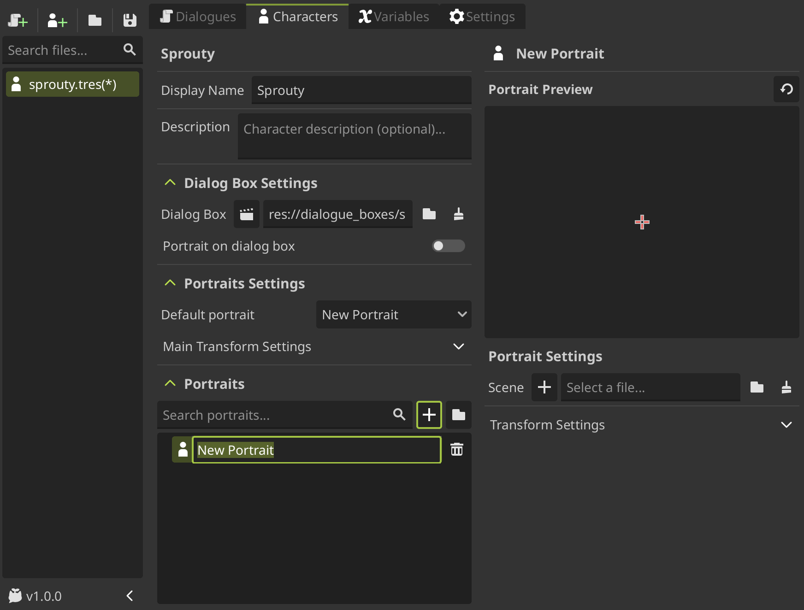
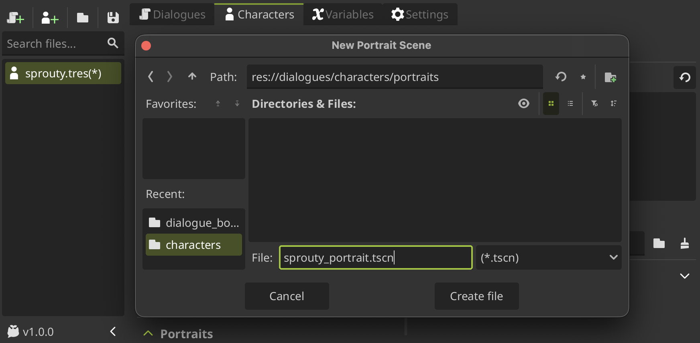
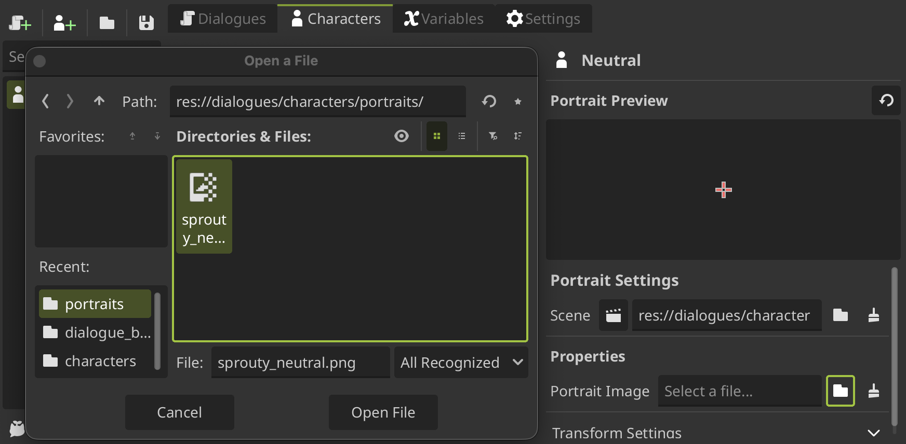
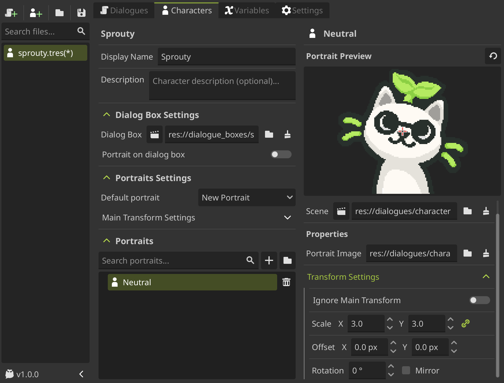
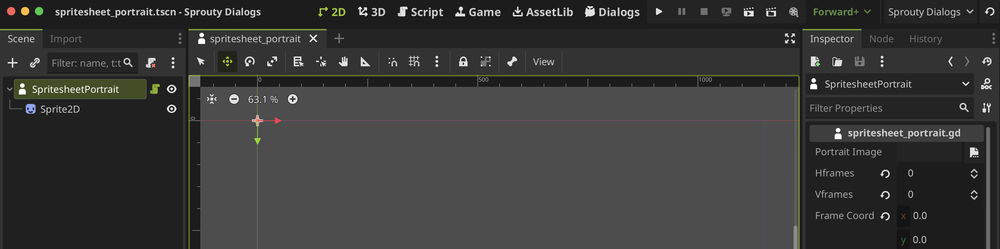
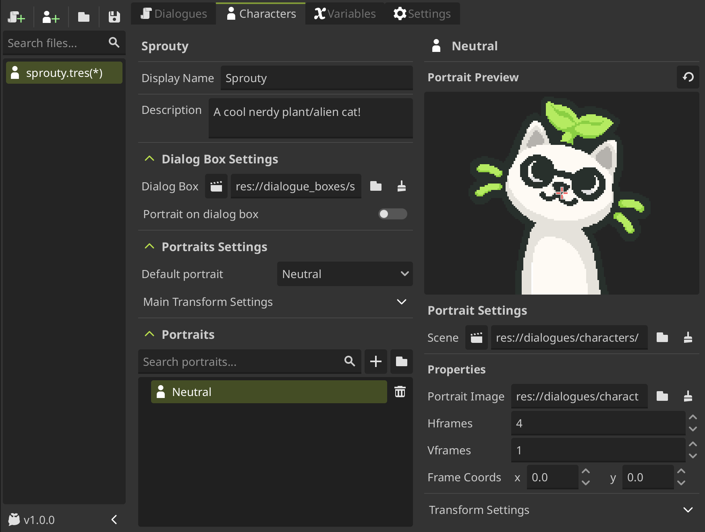
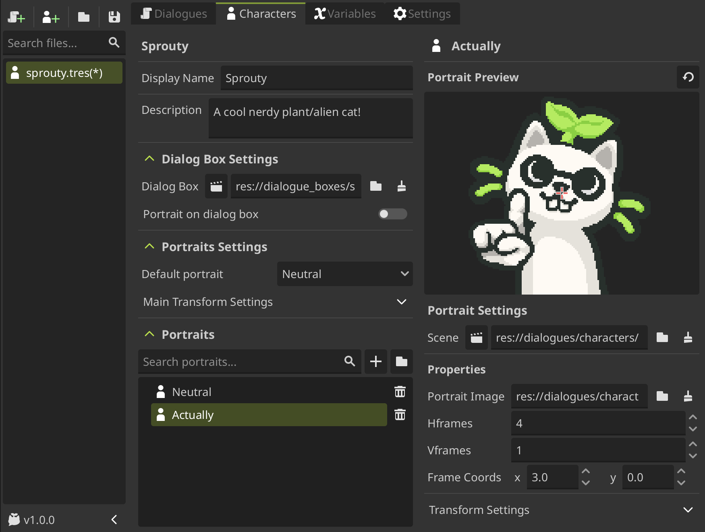

# Customize Portraits

We already saw how to use characters and portraits in the [using character](/docs/characters/using-characters.md) section. This section will cover how to create and customize your own portrait scenes.

## Portrait scenes

---

Each portrait have a corresponding **scene**, which is used to **render the portrait**.

When you create a new portrait to the portrait list, you need to **create a new portrait scene or use an existing one**, that allows you to **reuse the same scene for multiple portraits**.



To create a new portrait scene, **click on the `+` button** next to the `Scene` field in the portrait editor, locate where you want to save the file, give it a name and click on `Create File`.



By default, the new scene will be a template where you can **assign a image to display as portrait**. For that, you will see a `Portrait Image` property in a new `Properties` section where you can select an image.



After selecting an image, you can see the image as the portrait in the preview!



Additionally, you can edit the portrait transformation settings to change the position, scale, and rotation with which the portrait will be displayed on the screen.

But this is not all, _you can create your portrait scenes with its own properties and behavior!_

Let's see how to customize your portrait scene.

## Customize your portrait scene

---

When you create a new portrait scene, a **script with the same name** of the scene is created and attached to the scene automatically.

This script is a template that inherits from the [DialogPortrait](/docs/class-reference/nodes/dialog-portrait.md) class, and provide some methods that you can override to change the behavior of the portrait and also you can add your own properties to customize the portrait.

By default, this template have some animations to show how to use the overridable methods of the [DialogPortrait](/docs/class-reference/nodes/dialog-portrait.md) class. This animations look like this:


You can modify or remove these animations and create your own behavior by overriding the methods provided by the [DialogPortrait](/docs/class-reference/nodes/dialog-portrait.md) class.

### Overridable methods

[DialogPortrait](/docs/class-reference/nodes/dialog-portrait.md) provide the following methods that you can override to customize the behavior of your portrait. These are called automatically by the dialog system when certain events happen:

- `set_portrait()`: Called when the portrait is instantiated or changed. This is the **default behavior** of the portrait.

  > You can override this method to customize how the portrait scene is set up, for example, to set up custom properties or how the portrait is displayed.

- `on_portrait_enter()`: Called when the portrait **joins the scene**.

  > You can override this method to handle when the portrait enters the screen, for example, to create custom entrance animations.

- `on_portrait_exit()`: Called when the portrait **leaves the scene**.

  > You can override this method to handle when the portrait exits the screen, for example, to create custom exit animations.

- `on_portrait_talk()`: Called when the **character associated with the portrait starts talking** (typing dialogue starts).

  > You can override this method to create custom behavior when the character talks, for example, to create mouth movement animations.

- `on_portrait_stop_talking()`: Called when the **character associated with the portrait stops talking** (typing dialogue ends).

  > You can override this method to create custom behavior when the character stops talking, for example, to stop mouth movement animations.

- `highlight_portrait()`: Called when the **character is active in the dialog but not currently talking** (e.g. waiting for user input, joins without dialog).

  > You can override this method to update the portrait when the character is active, but is not talking.

- `unhighlight_portrait()`: Called when the **character becomes inactive in the dialog** (e.g. when the speaker is changed to another character).

  > You can override this method to update the portrait when the character becomes inactive.

### Export overrides

You can also add your own **exported properties** or variables to the portrait script to customize the portrait from the inspector and also from the portrait editor in the character settings.

For example, the template script includes an exported variable to customize the **portrait image** and a private variable to customize the **animation time** for the default animations:

```gdscript title="sprouty_portrait.gd" showLineNumbers
@tool
extends DialogPortrait

## Portrait image file path
@export_file("*.png", "*.jpg") var portrait_image: String

@export_group("Private")
## Animation time for default portrait animations
@export var animation_time: float = 1.0
```

The exported properties will be visible in the portrait editor in the `Properties` section when you select the portrait from the list:


As you see, the exported properties inside the **"Private"** group will not be visible in the portrait editor, but you can still modify them directly in the scene and in the portrait script. You can use this to create properties that are only used **internally by the portrait scene**.

In this way, you can create your own exported properties that allows to **reuse the same portrait scene** with different configurations for **multiple portraits**.

## Custom portrait example

---

Let's see how to create a portrait scene that allows to select a character expression from a spritesheet image.

To do that, we will create a new portrait scene and a new script attached in root that inherits from [DialogPortrait](/docs/class-reference/nodes/dialog-portrait.md) with a [Sprite2D](https://docs.godotengine.org/en/stable/classes/class_sprite2d.html) child, like the default template.


In the [Sprite2D](https://docs.godotengine.org/en/stable/classes/class_sprite2d.html) node, we can **assign a spritesheet image** that contains multiple expressions of the character, **slice the image** using the [Hframes](https://docs.godotengine.org/en/stable/classes/class_sprite2d.html#class-sprite2d-property-hframes) and [Vframes](https://docs.godotengine.org/en/stable/classes/class_sprite2d.html#class-sprite2d-property-vframes) properties that correspond to the **number of rows and columns in the spritesheet**, and display a specific expression using the [Frame](https://docs.godotengine.org/en/stable/classes/class_sprite2d.html#class-sprite2d-property-frame) or [Frame Coords](https://docs.godotengine.org/en/stable/classes/class_sprite2d.html#class-sprite2d-property-frame-coords) property to **select which frame to show**.

So, to do that in a reusable way to use the same scene for multiple portraits, we will add an exported property to select a spritesheet image, another two for `Hframes` and `Vframes` and another to select the `frame coords` of the expression to display (In case that the spritesheet has multiple rows and columns).

```gdscript title="spritesheet_portrait.gd" showLineNumbers
@tool
extends DialogPortrait

@export_file("*.png", "*.jpg", "*.svg") var portrait_image: String
@export var hframes: int
@export var vframes: int
@export var frame_coords: Vector2
```

These exported properties will be visible in the inspector when we select the portrait scene:



Then, in the [set_portrait](/docs/class-reference/nodes/dialog-portrait#set-portrait-method)() method, we will set the corresponding properties of the [Sprite2D](https://docs.godotengine.org/en/stable/classes/class_sprite2d.html) node to display the portrait using the exported properties:

```gdscript title="spritesheet_portrait.gd" showLineNumbers=10
var sprite: Sprite2D = $Sprite2D

func set_portrait() -> void:
    if portrait_image != "" and ResourceLoader.exists(portrait_image):
        sprite.texture = load(portrait_image)
        sprite.hframes = hframes
        sprite.vframes = vframes
        sprite.frame_coords = frame_coords
```

We add a validation to check that the `portrait_image` is not empty and exist before loading it to avoid errors.

Now, if we go to the character editor and create a new portrait using this portrait scene, we will see the exported properties in the portrait editor:


:::info

When you modify the portrait scene or its script, you need to **reload the scene** clicking on the **reset button above the preview** to see the changes reflected in the portrait editor.

:::

By assigning different spritesheet images and frame coordinates to different portraits, we can create multiple character expressions using the same portrait scene.



In this case, we only need to change the `frame coords` property to display different expressions from the same spritesheet image.



But we can do more things, for example, we can override the [on_portrait_talk](/docs/class-reference/nodes/dialog-portrait#on-portrait-talk-method)() and [on_portrait_stop_talking](/docs/class-reference/nodes/dialog-portrait#on-portrait-stop-talking-method)() methods to create a simple mouth movement animation when the character talks.

The spritesheet have a sprite with the mouth open expression, so we can change the `frame coords` property to switch between the normal expression and the mouth open expression when the character talks.

We can use a [Tween](https://docs.godotengine.org/en/stable/classes/class_tween.html) to create a looped animation that switches between both frames.

```gdscript title="spritesheet_portrait.gd" showLineNumbers=20
var tween: Tween

func on_portrait_talk() -> void:
    var start_frame = frame_coords.x
    tween = create_tween().set_loops()
    tween.tween_property(sprite, "frame_coords:x", start_frame + 1, 0.1)
    tween.tween_property(sprite, "frame_coords:x", start_frame, 0.1)

func on_portrait_stop_talking() -> void:
    tween.stop()
    sprite.frame_coords.x = 0
```

How the spritesheets only have one row, we only need to change the `x` coordinate of the `frame coords` property to switch between the normal expression and the mouth open expression.

Now, when the character talks, the portrait will animate **switching between the normal expression and the mouth open expression**, like this:


This is just a simple example of what you can do to customize your portrait scenes.

You can create more **complex behaviors and animations** by overriding the provided methods and adding your own properties and logic to the portrait script.

:::info

If you want to reuse a portrait scene for all your characters, you can set a **default portrait scene** in [general settings](/docs/settings#defaults).

:::warning
When you change the default portrait scene, this scene will also **become the new default template** to create new portrait scenes.

:::

Now that you know how to create and customize your own portrait scenes, you can _create unique and dynamic portraits for your characters in your game!_
