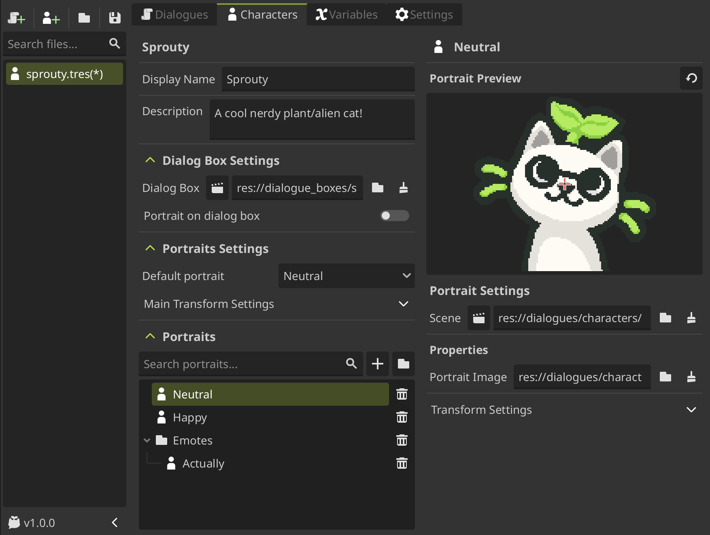
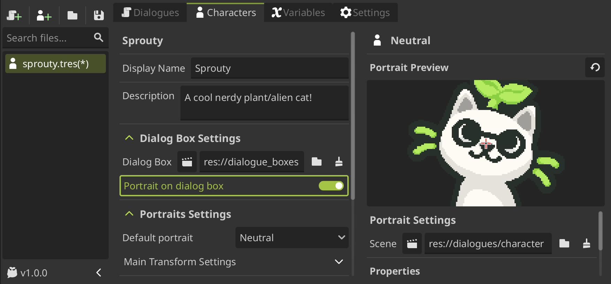
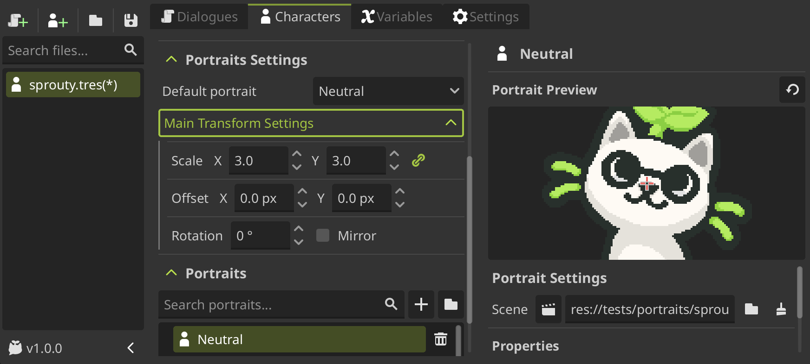
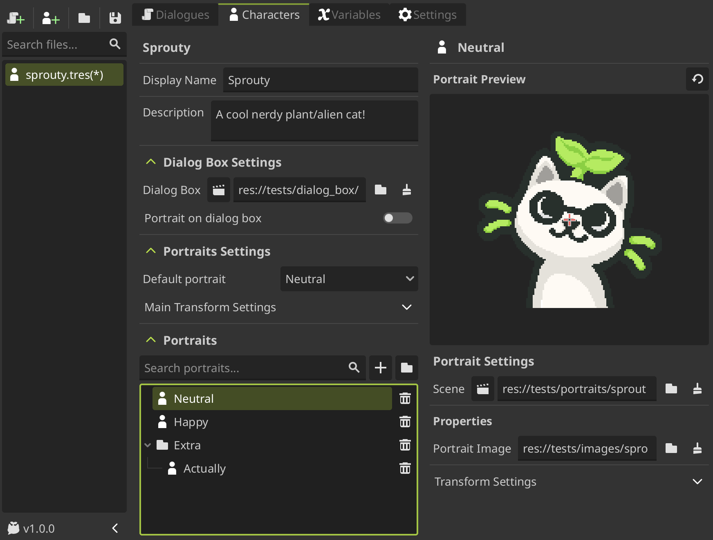

# Using Characters

We already saw how to create a character in the [create a character](/docs/getting-started//create-a-character.md) section, but some details are missing. This section will cover all the character properties and how to use them.

Let's review the character editor and all its settings.

## Main settings

---

In the character data file, you can see several properties that you can configure for your character. Let's see them one by one.

- `Key name`: The **unique identifier** for the character, shown above the display name. This name will be used to **refer to the character in the dialogues**.

  > Corresponds to the **file name with which the character was created**.

  :::warning[Important]

  It **cannot be changed** after creating the character, even if you **rename** the file. _So choose it wisely!_

  :::

- `Display Name`: The name that will be displayed in the dialog box when the character speaks. This can be translated if you have **translations enabled**.

  > 
  >
  > Also, you can use **variables, expressions and rich text formatting** in the display name. See more information in the [variables in character names](/docs/variables#variables-in-character-names) section.

- `Description`: A description for your own reference. Does nothing.

## Dialog box settings

---

You can also assign a specific dialog box for the character. For that you have some settings.

- `Dialog Box`: The dialog box scene that will be used when this character speaks.

  > To assign a dialog box, you need to load a dialog box scene or create a new one. For more information about dialog boxes, see the [dialog boxes](/docs/dialogues/dialog-boxes.md) section.

- `Portrait on Dialog Box`: If you want to **display the character portrait inside the dialog box**, you must enable this property.

  > If is enabled, the portrait will be displayed inside the dialog box, where you configure the `Portrait Display` component of the dialog box.
  >
  > 
  > See more information in the [using portraits in dialog boxes](/docs/dialogues/dialog-boxes#using-portraits-in-dialog-boxes) section.

## Portraits settings

---

You can also configure some settings for the character portraits.

- `Default Portrait`: The default portrait that will be used when the character speaks if **no specific portrait is assigned in the dialogue**.

- `Main Transform Settings`: The main transform settings for all the character portraits. This settings will be **applied to all the character portraits by default**, but you can override them in a specific portrait by configuring its own `Transform Settings`.
  > This settings are the following:
  >
  > - `Scale`: The default scale of the character portraits.
  > - `Offset`: The default position of the character portraits.
  > - `Rotation`: The default rotation of the character portraits.
  > - `Mirror`: If enabled, the character portraits will be mirrored horizontally.

## Portrait list

---

Finally, you can see the list of portraits assigned to the character. You can add as many portraits as you want and organize them in groups.

You can create different portraits for different expressions, poses, outfits, etc. You can then use these portraits in the dialogues by **selecting the portrait** in a [Dialogue Node](/docs/dialogues/event-nodes#dialogue-node), after selecting the character.

To learn how to configure portraits, continue to the [customize portraits](/docs/characters/customize-portraits.md) section.
