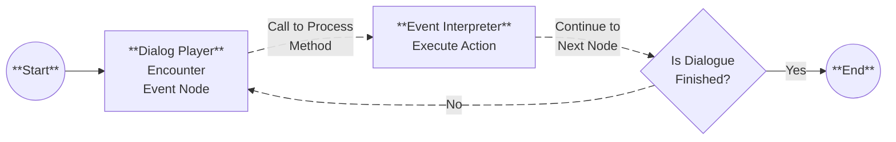

# Custom Event Nodes

_You can make your own event nodes to **extend the functionality of the dialogue system!**_

Event nodes allow you to **trigger specific actions or behaviors during a dialogue**, such as playing animations, changing variables, or interacting with other game systems.

Let's explore how to create custom event nodes and use them in your dialogues.

## How event nodes work?

---

Each event node corresponds to a **specific action or behavior** that can be triggered during a dialogue. To process an event node, we have the [SproutyDialogsEventInterpreter](/docs/class-reference/utils/event-interpreter.md) class, which is responsible for **executing the actions** associated with event nodes.

The event interpreter has a **process method** for each event node type, which contains the logic to handle that specific event. To do this, the [DialogPlayer](/docs/class-reference/nodes/dialog-player.md) creates and uses the **event interpreter as its child** to process event nodes as they are reached during the dialogue flow.

So when the dialog player encounters an event node, it calls to the event interpreter to execute the associated action.



## Creating a custom event node

---

To create custom event nodes, first you need to create a new graph node that extends from the [SproutyDialogsBaseNode](/docs/class-reference/core/base-node.md) class. This new node will represent your custom event node in the graph editor.

To do this, you need to **create a new scene** with a [GraphNode](https://docs.godotengine.org/en/stable/classes/class_graphnode.html) node as root, and then attach a **new script** to it that extends from the [SproutyDialogsBaseNode](/docs/class-reference/core/base-node.md) class.

:::warning

The **name of the scene file** must be the **same as the node name** that you will use to identify your custom event node in the dialogue system.

Also, the name should be in **snake_case format** (lowercase letters with underscores).

:::

Here's an example of a custom event node called `Custom Node`:


As you can see, the [SproutyDialogsBaseNode](/docs/class-reference/core/base-node.md) has some inspector properties that you can configure to set the **node's titlebar color and icon**. Also, you can change the title of the node in the [GraphNode](https://docs.godotengine.org/en/stable/classes/class_graphnode.html) properties.

:::info

When you change the **color and icon** of the node in the inspector, the node will **not automatically update** its titlebar. _You need to **save the scene and reopen it** to see the changes applied._

:::

This node only has a **text input component** to enter a message that will be printed to the console when the event is processed. You can add more components to the node to customize its functionality as needed.

Also, you can add more **output ports to the node**, if you want to **connect the node to multiple next nodes**, like in a branching event. To do this, your node needs **at least one child node for each output port**, to set slots for the connections. You can enable the ports that you want in the `slot` section in the inspector.

For more information about ports, see the [GraphNode documentation](https://docs.godotengine.org/en/4.4/classes/class_graphnode.html).

:::info

You can add more input ports also, but for Sprouty Dialogs event nodes, **only the first input port is used** to connect the previous node.

:::

### Handling the event node logic

Now that you have your node set up, you need to **implement the logic** of your custom event node to **handle the node in the graph editor** in the script attached to it.

> _The actual processing of the event node will be done in an custom event interpreter, which we will see later._

There are two methods that **you need to override** in your custom event node script:

- [get_data](/docs/class-reference/core/base-node.md#get-data-method)(): This method should return a dictionary containing the data of the event node. You need to include some **required properties** and also can include any properties or values that you want to store to **save the state** of the event node and **process it** later.

- [set_data](/docs/class-reference/core/base-node.md#set-data-method)(): This method take a dictionary as a parameter and set or **load the properties** of the event node based on the values in the dictionary.

Here's an example implementation of the `Custom Node` event node script:

```gdscript title="custom_node.gd" showLineNumbers
@tool
extends SproutyDialogsBaseNode

@onready var _text_input: TextEdit = $TextInput
@onready var _print_text: String = _text_input.text


func _ready():
	super () # Required to initialize the node
	_text_input.text_changed.connect(_on_text_input_changed)


func get_data() -> Dictionary:
	var dict := {}

	dict[name.to_snake_case()] = {
		# Required node data
		"node_type": node_type,
		"node_index": node_index,
		"offset": position_offset,
		"size": size,

		# Get the node output connections
		"to_node": get_output_connections(),

		# Custom node data
		"print_text": _print_text,
	}
	return dict


func set_data(dict: Dictionary) -> void:
	# Load required node data
	node_type = dict["node_type"]
	node_index = dict["node_index"]
	position_offset = dict["offset"]
	to_node = dict["to_node"]
	size = dict["size"]

	# Set print text in the input field
	_text_input.text = dict["print_text"]
	_print_text = dict["print_text"]


func _on_text_input_changed() -> void:
	_print_text = _text_input.text
```

As you can see, in the `get_data()` method we are returning a dictionary with the required node data and also our custom property `print_text`, which contains the text to print when the event is processed.

In the `set_data` method, we are loading the required node data from the dictionary and also setting the `print_text` property from the dictionary value.

In this way, the dialogue system can **save and load the custom event node data** correctly.

:::info

In this example, we are using a [TextEdit](https://docs.godotengine.org/en/stable/classes/class_textedit.html) component to enter the text to print, and we are connecting to its `text_changed` signal to update the `_print_text` property when the user changes the text.

Depending on the components that you add to your custom event node, you may need to implement **additional logic** to handle user interactions or updates to the node properties.

:::

To understand more about how to make your own nodes, you can check the built-in event nodes in the `event_nodes` folder (`res://addons/sprouty_dialogs/event_nodes/`).

### Handling the event node processing

To process your new event nodes, you need to create a custom event interpreter that extends from the [SproutyDialogsEventInterpreter](/docs/class-reference/utils/event-interpreter.md) class. This new interpreter will be responsible for **processing your custom event nodes** during the dialogue flow.

The event interpreter have a dictionary called `node_processors`, which maps the **node names to their corresponding process methods**. To handle your custom event node, you need to **add an entry** to this dictionary that maps the node name to a method that will process the node data.

Here's an example implementation of a custom event interpreter that can process the `Custom Node` event node:

```gdscript title="custom_event_interpreter.gd" showLineNumbers
extends SproutyDialogsEventInterpreter

func _init():
	# Add the process method to the processors with the node name
	node_processors["custom_node"] = _process_custom_node


## Process the node data to do something
func _process_custom_node(node_data: Dictionary) -> void:
	# Print a debug message
	if print_debug: print("[Sprouty Dialogs] Processing custom node...")

	# Print the text from the node data
	print_rich("[color=tomato][b]Custom Node Print:[/b][/color] " + node_data.print_text)

	# Call to continue to the next node
	continue_to_node.emit(node_data.to_node[0])
```

In this example, the `_process_custom_node()` method is defined to handle the processing of the `Custom Node` event node. It takes the `print_text` property from the node data dictionary and prints it to the console.

Finally, it calls the `continue_to_node` signal to move to the next node in the dialogue flow. This line is necessary to **ensure that the dialogue continues** after processing the event node.

:::info

You can access to the dialogue resources from the [DialogPlayer](/docs/class-reference/nodes/dialog-player.md) using `get_parent()`, if you need to access any data from the dialogue (such as the character data) while processing your custom event nodes.

:::

## Using custom event nodes

---

Having your custom node and custom event interpreter ready, you need to set up some settings to use them in your dialogues. For that, you need to go to the [general settings](/docs/settings#general-settings) in the Sprouty Dialogs settings tab.


Here, you need to do the following:

1. **Enable the use of custom event nodes** by checking `Use custom event nodes`.
2. Set the `Custom event nodes folder` property with the **path to the folder where your custom event node scenes are located**.
3. Set your custom event interpreter script in the `Custom event interpreter` setting. In this way, the **dialog players will use your custom event interpreter** to process the event nodes during the dialogue flow.

:::warning

You should save your custom event nodes and custom event interpreter **outside the plugin folder**, to avoid losing your custom nodes when updating the plugin.

:::

Now, you can create dialogues using your custom event nodes in the [Dialogue Editor](/docs/getting-started/meet-the-editor#dialogue-editor). You will see your custom event node available in the event nodes list to add it to the graph.


And you can use it like any other event node in the graph editor.


When the dialogue is played, the dialog player will use your custom event interpreter to process the event nodes, including your custom event nodes.

Here's an example of the output when the dialogue with the custom event node is played:


As you can see, the custom event node is processed correctly, and the **text entered in the node is printed to the console** as we expect.

:::info

You can access to this custom event node and custom event interpreter example, in the `custom_event_nodes` folder inside the event nodes folder (`res://addons/sprouty_dialogs/event_nodes/custom_event_nodes/`).

So you can use it as a reference or starting point to create your own custom event nodes and interpreter.

:::

Congratulations! You have successfully created your own custom event node.

You can now create more complex event nodes and interpreters to extend the functionality of your dialogues even further.
