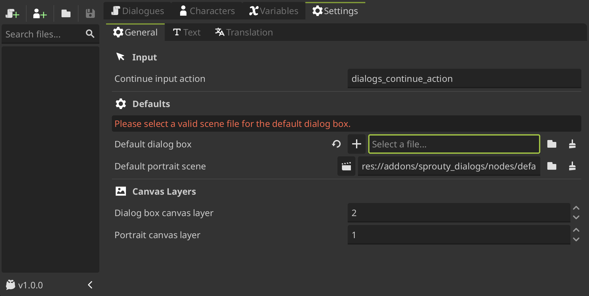

# Dialog Boxes

The dialogues are displayed on screen using dialog boxes. Sprouty Dialogs allows you to customize the appearance and behavior of these dialog boxes to fit your game's style. _You can do whatever you want!_

## Using dialog boxes

---

By default, there is a **default dialog box** that will be displayed for all dialogues. You can change this dialog box in the `Default dialog box` setting from [general settings](/docs/settings#defaults), selecting a existing dialog box or creating a new one.

To create a new dialog box, clean the path in the field and **you will see a `+` button, click it, locate where you want to save the file**, give it a name and then click on `Create File`.

:::warning

If you change the `Default Dialog Box` in the settings, this dialog box will also become the new template when creating a new dialog box.

:::

You can also assign a custom dialog box for each character. With a character file open, you can **create a new dialog box scene clicking the `+` button in the `Dialog Box` property**, locate where you want to save the file, give it a name and click on `Create File`.

When you create a new dialog box scene, **the scene will open in the editor for editing**. This scene by default is a **template** with a basic dialog box layout.

:::info

In the file manager, you can see that in addition to the scene, **a script with the same name was created**: `sprouty_dialog_box.gd`.

This script is a template that inherits from the [DialogBox](/docs/class-reference/nodes/dialog-box.md) class, and you can edit it to **customize the behavior of the dialog box with more advanced features**, for example, to add animations when the dialog box opens or closes. See more in [Advanced Customization](#advanced-customization).

:::

Now, let's see how we can customize the dialog boxes!

## Customize dialog boxes

---

You will going to see that the dialog box node have some properties in the inspector. First of all, you can override the `Typing Speed` and `Max Characters` settings for a specific dialog box. If you don't change them, the default parameters from [text settings](/docs/settings#text-settings) will be used.

Also, there is a `Dialog Box Components` section, where some components are required. This components are:

- `Dialogs Display`: [RichTextLabel](https://docs.godotengine.org/en/stable/classes/class_richtextlabel.html) where the dialogue text will be displayed. _**This component is required to display the dialogue text in it.**_

- `Name Display`: [RichTextLabel](https://docs.godotengine.org/en/stable/classes/class_richtextlabel.html) where character name will be displayed. _If you want to **display the character name in the dialog box**, you need to set this property._

  :::info[Important]

  The [RichTextLabel](https://docs.godotengine.org/en/stable/classes/class_richtextlabel.html) components need to have enable the `BBCode enabled` property to display the text effects from the text editor.

  :::

- `Continue Indicator`: A [Control](https://docs.godotengine.org/en/stable/classes/class_control.html) node as a Visual indicator to indicate press for continue the dialogue (e.g. an arrow). _If you want to **display a continue indicator in the dialog box**, you need to set this property._

- `Portrait Display`: A [Node](https://docs.godotengine.org/en/stable/classes/class_node.html) where the character portrait will be displayed (parent node). _If you want to **display the portrait in the dialog box**, you need to set this property._

**You don't need to use all the components in the template**; you can configure your dialog box however you want. Just keep in mind that you **need the components indicated in the inspector** depending on what you're going to do.

> _For example, if you **don't want to show the character name in the dialog box**, you can not assign the `Display Name` component and the **name will be not displayed**._

Lastly, there is a `Options Components` section with the follow properties:

- `Options Container`: [Container](https://docs.godotengine.org/en/stable/classes/class_container.html) where the options will be displayed in the dialog box. It is recommended to use a [VBoxContainer](https://docs.godotengine.org/en/stable/classes/class_vboxcontainer.html) or [GridContainer](https://docs.godotengine.org/en/stable/classes/class_gridcontainer.html) to display the options. _This component is required to display the dialog options in it._

- `Option Template`: Node that will be used as a template for the options in the dialog box. It should be a [DialogOption](/docs/class-reference/nodes/dialog-option.md) node or a node that extends from it. _This component is required to display the dialog options._

This components are **not required only if you don't want to display options** in the dialogue, what means that you are not going to use [options nodes](/docs/dialogues/event-nodes#options-node) in your dialogue trees.

Here is an example of a dialog box customized with custom components:

As you can see, in this case, the `Portrait Display` component is not used because this dialog box will not display any portraits in it. The same applies to the other components, **except for `Dialogs Display`, which is a necessary component to display the dialogs**.

## Using portraits in dialog boxes

---

In you want to display a portrait in the dialog box you need to set the `Portrait Display` component in the inspector. This component will be the parent node where the portrait is going to be added to the scene, so basically **defines the position of the portrait on the screen**.

Also, you need to enable the `Portrait on dialog box` property in the character that you want to be displayed on a dialog box. For more information see [Characters & Portraits](/docs/characters) section.

[image of portrait on dialog box]

## Advanced Customization

---

[how edit the script template]

## Dialog Box Signals

---

[url metaclick signal]
