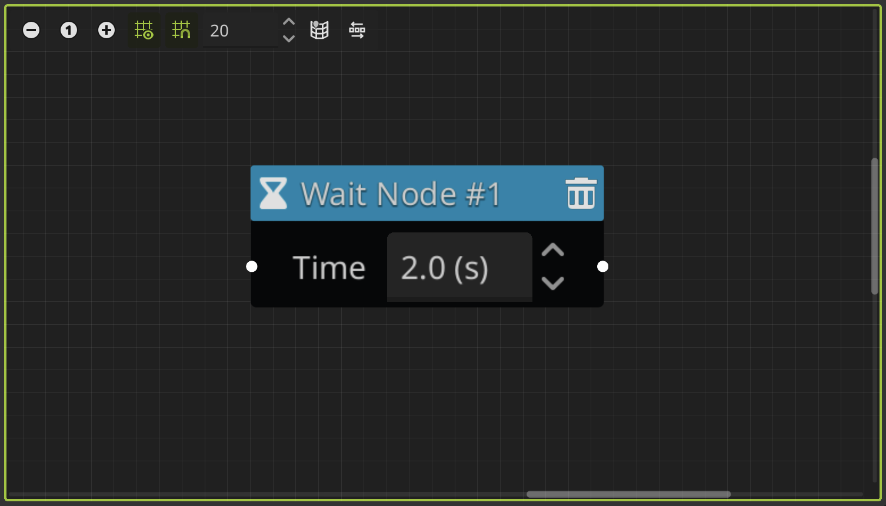

# Event Nodes

The event nodes are the **building blocks of the dialogue system**. They are graph nodes that can trigger different events in the dialogue. Let's take a look at each of them.

## Start Node

---

This node define the **beggining of a dialogue tree**. You must **assign it an `ID` that will be the name or reference** for calling the dialogue tree later. Also, you can see that this node have a **play button**, you can click on it to [test your dialogue tree](/docs/getting-started/create-a-dialogue#test-the-dialogue).

You can have **more than one dialogue tree** in the same dialogue data file, so **each `Start Node` needs an unique `ID`**. This identifier not only defines the dialogue tree, they are also used to identify the dialogues itself.

:::warning[Important]

If you want to use **translations** with CSV files, you must ensure that **all your dialogue trees in the project have unique `ID`s**, not only the dialogue trees in the same file.

:::

## Dialogue Node

---

This node is where you set the dialogues to display. This node allows you to write your dialogues and **assign a character to the dialogue**, selecting a character data file, and then **select a portrait from it to display on screen** when the dialogue is played.

To write your dialogues, you can expand the text box **clicking on the right button** that will open the **text editor** on the right side. Here you can easily add [BBCode](https://docs.godotengine.org/en/latest/tutorials/ui/bbcode_in_richtextlabel.html) tags to the text in a user-friendly interface, so you don't have to remember all the tags and its properties. For more details about the text editor, see the [text editor section](/docs/dialogues/text-editor.md).

:::info[Using Translations]

When you use **translations**, this node also allows you to edit the translations here in the same way. A text box is added for each **locale** or language that you have set in the [translation settings](/docs/settings#locales-settings), and can be accessed through a new expandable section called “translations” at the bottom of the node.

The main dialogue text box is going to have the dialogue in the **default locale**, that you can set in the [translation settings](/docs/settings#locales-settings). In this example, you can see that the default locale is English (en).

:::

## Options Node

---

This node allows you to add options or choices to the dialogue. You can add **multiple options and connect them to any node to define different actions or branches of the dialog tree** depending on the selected option.

Each option will be displayed in a [DialogOption](/docs/class-reference/nodes/dialog-option.md) node when the dialogue runs. You can customize how looks the options buttons in your dialog box. For more information see the [customize options section]().

:::info[Using Translations]

When you use **translations**, this node also allows you to edit the translations here in the same way that in the dialogue nodes. For each option, a new expandable "translations" section is added at the bottom, with a text box for each locale or language that you have set in the [translation settings](/docs/settings#locales-settings).

In the same way as before, the main option text box is going to have the dialogue in the **default locale**, that you can set in the [translation settings](/docs/settings#locales-settings). In this example, the default locale is English (en).

:::

## Set Variable Node

---

This node allows you to **change the value of a variable** during the dialogue tree. You can select the type of the variable, then write the name of the variable that you want to change, select an **assignment operator (such as: =, +=, \*=, etc)** and give it the new value. The value field updates depending on the variable type.

You can set the **variables defined in the plugin or global variables**. Considering the following:

- If you variables is inside a group you need to specify the whole path to it: `group1/group2/variable`
- If you want to use global variables, you need to specify the autoload name followed by a dot and the variable name: `AutoloadName.variable`.

For more information about variables, see the [variables section](/docs/variables.md).

## Condition Node

---

This node allows you to condition the flow of the dialogue tree. You can **check a relation between different types of variables**, and then if the condition is true, the dialogue tree is going to continue with the event node connected to the `true` slot, otherwise, is going to continue with the event node connected to the `false` slot.

You can compare variables, expressions, values, etc. For more information about it, see the [variables section](/docs/variables.md).

## Signal Node

---

This node allows you to emit a signal during the dialogue. It **receives an [String](https://docs.godotengine.org/en/stable/classes/class_string.html) argument**, that is going to be emited with the signal. You can use the argument to **identify the signal** or wharever you want to do with, like parse more than one argument separated by a symbol, such as a comma.

:::info[Using Signals]

To **catch the signal outside the dialogue**, you need to connect the [signal_event](/docs/class-reference/nodes/dialog-player#signal-event-signal) signal from the [DialogPlayer](/docs/class-reference/nodes/dialog-player.md) node where you run the dialogue.

:::

## Wait Node

---

This node allows you to **wait a few seconds** between events in a dialogue tree. You must define the wait time in seconds in the node field.

## Comment Node

---

The node is useful to add comments in the graph. Do nothing, it is only for reference.

---

In the future, _more event nodes will be added!_

Also, you can create your own custom event nodes. See the [custom event nodes](/docs/dialogues/custom-event-nodes.md) section for more information.
