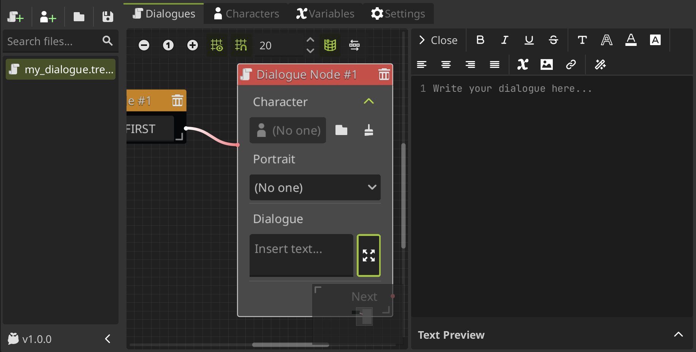
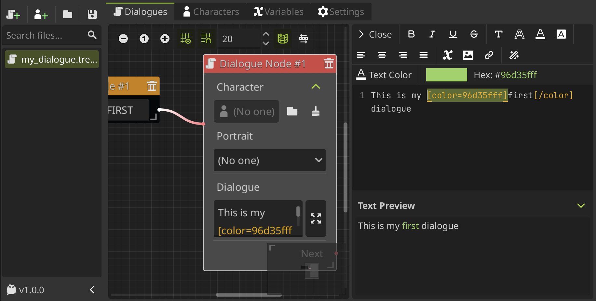
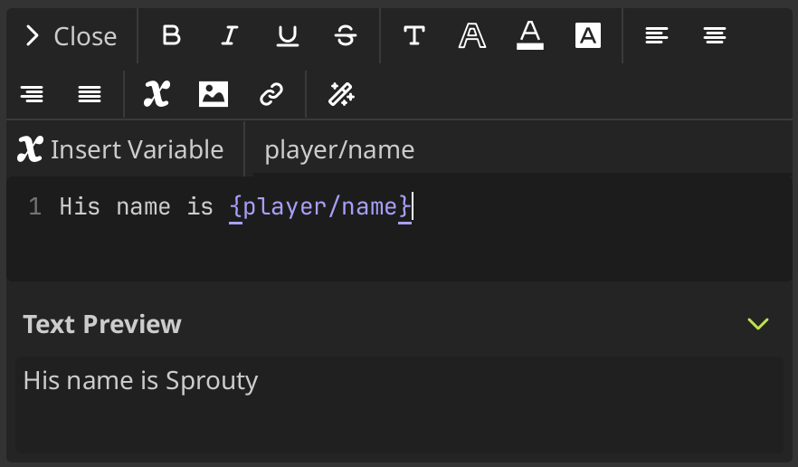

# Text Editor

The text editor allows you to write your dialogues using various formatting options and text effects with [BBCode](https://docs.godotengine.org/en/stable/tutorials/ui/bbcode_in_richtextlabel.html) to enhance the your the dialogues in a user-friendly interface.

In this way, you can simply use the toolbar to add them to your text. _You don't have to remember all the tags and its properties!_

## What is BBcode?

---

To use formatting and effects in text, Godot uses the [BBCode](https://docs.godotengine.org/en/stable/tutorials/ui/bbcode_in_richtextlabel.html) markup syntax, a simple tags system to format text. In general, BBCodes consist of 3 parts: _**the opening tag, the content and the closing tag**_.

The opening tag indicates the start of the formattings and can also include parameters, the content is the text to be formatted, and the closing tag indicates the end of the formatting.

> For example: `[color=red]hello world[/color]`
>
> - `[color=red]` is the opening tag, with `color` as the tag name and `red` as the parameter.
> - `hello world` is the content, the text to be formatted.
> - `[/color]` is the closing tag, indicating the end of the color formatting.

:::info

Some tags do not require a closing tag, such as `[br]` for line breaks.

:::

To use BBCode in your dialogues, the dialogue must be displayed using a [RichTextLabel](https://docs.godotengine.org/en/stable/classes/class_richtextlabel.html#class-richtextlabel) node, which supports [BBCode](https://docs.godotengine.org/en/stable/tutorials/ui/bbcode_in_richtextlabel.htm) formatting. You need to ensure the [bbcode_enabled](https://docs.godotengine.org/en/stable/classes/class_richtextlabel.html#class-richtextlabel-property-bbcode-enabled) property is set to `true`.

## Using the text editor

---

When you are writting dialogues in a dialogue node, options node, or any text box, you can expand it **clicking on the right button** and the **text editor** will be open on the right side.

You can simply **select the text you want to be affected by the tags** and click a option button in the toolbar to add the tags. The editor will automatically insert the [BBCode](https://docs.godotengine.org/en/stable/tutorials/ui/bbcode_in_richtextlabel.html) tags around the selected text.

You can **change the properties of the tag while you have the _opening tag_ selected**, then you can modify the properties in the toolbar to update the tag. For example, in this case we change the color of the text.

You can also **edit or add the tags manually** by typing them directly in the text editor.

Each option have their own effects and properties that you can modify. The text editor do not consider all of the BBCode tags, only the most common ones, you can see all the tags available in the [BBCode reference](https://docs.godotengine.org/en/stable/tutorials/ui/bbcode_in_richtextlabel.html#reference).

Now, let's see all the options available in the text editor toolbar!

## Font styles options

---

- **Bold**: Makes the selected text bold. Tag: `[b]{text}[/b]`

- **Italic**: Makes the selected text italic. Tag: `[i]{text}[/i]`

- **Underline**: Underlines the selected text. Tag: `[u]{text}[/u]`

- **Strikethrough**: Adds a strikethrough line to the selected text. Tag: `[s]{text}[/s]`

### Customize font style

There is a **Font Style** option that allows you to configure the font properties of the selected text. Its tag format is: `[font s={size} n={font_name} ...]{text}[/font]`

You can change the **size** and **font** of the selected text, as well as other advanced properties.

You can change the following properties:

- **Size (s)**: Changes the font size of the selected text. Property: `s={size_in_pixels}`

- **Font (n)**: Changes the font of the selected text. Property: `n={font_resource_path}`

  > _You need to have the font added to the project resources to use it._

- **Glyph Spacing (gl)**: Adjusts the spacing between glyphs (characters) in the selected text. Property: `gl={spacing_in_pixels}`

- **Space Spacing (sp)**: Adjusts the spacing of the space character in the selected text. Property: `sp={spacing_in_pixels}`

- **Top Spacing (ts)**: Adjusts the spacing above the selected text. Property: `ts={spacing_in_pixels}`

- **Bottom Spacing (bs)**: Adjusts the spacing below the selected text. Property: `bs={spacing_in_pixels}`

- **Embolden (emb)**: Makes the selected text bolder by increasing the weight of the font. Property: `emb={strength}`

  > _If it is not equal to zero, emboldens the font outlines. Negative values reduce the outline thickness._

- **Slant (sln)**: Slants the selected text to create an oblique effect. Property: `sln={strength}`

  > _Positive values slant glyphs to the right. Negative values to the left._

## Text appearance options

---

- **Text Outline**: Adds an outline to the selected text. You can change the outline size and color. Tag: `[outline_size={size}][outline_color={color}]{text}[/outline_color][/outline_size]`

  > _This option is composed of two nested tags: `outline_size` and `outline_color`, where you can set the size and color of the outline respectively._

- **Text Color**: Changes the color of the selected text. You can choose a color from the color picker. Tag: `[color={color}]{text}[/color]`

- **Background Color**: Changes the background color of the selected text. You can choose a color from the color picker. Tag: `[bgcolor={color}]{text}[/bgcolor]`

  > _**Note:** There is also a `[fgcolor={color}]` tag to change the **foreground** color of the text._

## Text alignment options

---

- **Align Left**: Aligns the selected text to the left. Tag: `[left]{text}[/left]`

- **Align Center**: Aligns the selected text to the center. Tag: `[center]{text}[/center]`

- **Align Right**: Aligns the selected text to the right. Tag: `[right]{text}[/right]`

- **Align Fill**: Justifies the selected text. Tag: `[justify]{text}[/justify]`

## Insert options

---

### Insert variables

To insert a variable, you can use the **Insert Variable** option in the toolbar. You can **select the type of the variable** to filter the variables shown in the dropdown when you **enter the variable name in the input field**, and then **select it from the dropdown** or press `[Enter]` to add it.

In this case, we do not insert a BBCode tag here, but rather a special placeholder that will be replaced by the value of the variable at runtime. Its format is: `{variable_name}`.

:::info[Important]

You can insert any variable defined in the plugin, **including global variables**, but they are not going to be displayed in the text editor, because their values are only known at runtime.

:::

For more information about variables, you can check the [variables section](/docs/variables.md).

### Insert images

To insert an image, you can use the **Insert Image** option in the toolbar. You must **enter the image resource path in the input field** and press `[Enter]` to add it. Its tag format is: `[img]{image_resource_path}[/img]`

You not only can insert images, but you can also change its size and other settings modifying its properties.

You can change the following properties:

- **Width (w)**: Sets the width of the image in pixel or percentage. Property: `w={width_in_pixels_or_%}`

- **Height (h)**: Sets the height of the image in pixel or percentage. Property: `h={height_in_pixels_or_%}`

- **Padding (pad)**: If set to true, and the image is smaller than the size specified by width and height, the image padding is added to match the size instead of upscaling. Property: `pad={true/false}`

- **Region (region)**: Define the region rect of the image. This can be used to display a single image from a spritesheet. Property: `region={x,y,w,h}`

- **Color (color)**: Sets a modulate color for the image. Property: `color={color}`

### Insert Links

To insert a link, you can use the **Insert Link** option in the toolbar. You must **select the text to be linked and enter the URL in the input field**, then press `[Enter]` to add it. Its tag format is: `[url={url}]{text}[/url]`

By default, when the user clicks on it, its going to **open the URL in a web browser**, if you have enabled the `Open URL on meta tag click` setting in the [text settings](/docs/settings#text-settings) of the plugin.

:::info

If you want to customize this behavior, for more advanced use cases, it's also possible to store JSON in a `[url]` tag's option and parse it in the function that handles the `meta_clicked` signal of the [RichTextLabel](https://docs.godotengine.org/en/stable/classes/class_richtextlabel.html).

For dialogues, you need to connect to the `meta_clicked` signal from the [DialogBox](/docs/class-reference/nodes/dialog-box.md) to implement the desired behavior when a URL is clicked.

:::

## Text effects

---

The text editor provides some animated effects supported by default by Godot that you can see in [text effects in godot docs](https://docs.godotengine.org/en/stable/tutorials/ui/bbcode_in_richtextlabel.html#text-effects). You can access them through the **Effects** menu in the toolbar.

### Pulse

Pulse creates an **animated pulsing effect** that multiplies each character's opacity and color. Its tag format is:
`[pulse freq=1.0 color=#ffffff40 ease=-2.0]{text}[/pulse]`

- `freq` controls the frequency of the half-pulsing cycle (higher is faster). A full pulsing cycle takes 2 \* (1.0 / freq) seconds.
- `color` is the target color multiplier for blinking. The default mostly fades out text, but not entirely.
- `ease` is the easing function exponent to use. Negative values provide in-out easing, which is why the default is -2.0.

### Wave

Wave **makes the text go up and down** in a wave form (obviously). Its tag format is:
`[wave amp=50.0 freq=5.0 connected=1]{text}[/wave]`.

- `amp` controls how high and low the effect goes.
- `freq` controls how fast the text goes up and down. A freq value of 0 will result in no visible waves, and negative freq values won't display any waves either.
- If `connected` is 1 (default), glyphs with ligatures will be moved together. If connected is 0, each glyph is moved individually even if they are joined by ligatures. This can work around certain rendering issues with font ligatures.

### Tornado

Tornado **makes the text move around in a circle**. Its tag format is: `[tornado radius=10.0 freq=1.0 connected=1]{text}[/tornado]`.

- `radius` is the radius of the circle that controls the offset.
- `freq` is how fast the text moves in a circle. A freq value of 0 will pause the animation, while negative freq will play the animation backwards.
- If `connected` is 1 (default), glyphs with ligatures will be moved together. If connected is 0, each glyph is moved individually even if they are joined by ligatures. This can work around certain rendering issues with font ligatures.

### Shake

Shake **makes the text shake** (duh). Its tag format is: `[shake rate=20.0 level=5 connected=1]{text}[/shake]`.

- `rate` controls how fast the text shakes.
- `level` controls how far the text is offset from the origin.
- If `connected` is 1 (default), glyphs with ligatures will be moved together. If connected is 0, each glyph is moved individually even if they are joined by ligatures. This can work around certain rendering issues with font ligatures.

### Fade

Fade creates a static **fade effect that multiplies each character's opacity**. Its tag format is: `[fade start=4 length=14]{text}[/fade]`.

- `start` controls the starting position of the falloff relative to where the fade command is inserted.
- `length` controls over how many characters should the fade out take place.

### Rainbow

Rainbow gives the text a **rainbow color that changes over time**. Its tag format is: `[rainbow freq=1.0 sat=0.8 val=0.8 speed=1.0]{text}[/rainbow]`.

- `freq` determines how many letters the rainbow extends over before it repeats itself.
- `sat` is the saturation of the color of the rainbow.
- `val` is the value of the color of the rainbow.
- `speed` is the number of full rainbow cycles per second. A positive speed value will play the animation forwards, a value of 0 will pause the animation, and a negative speed value will play the animation backwards.
