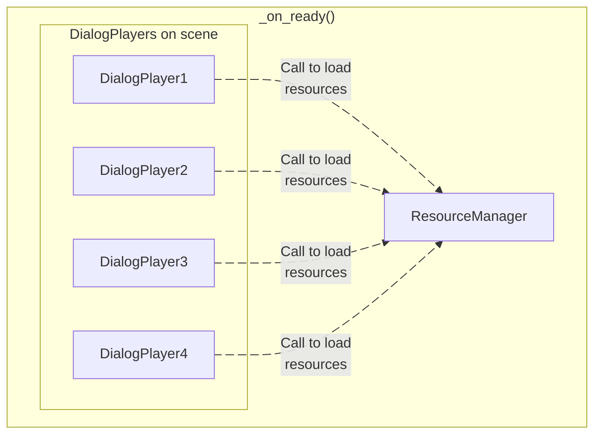

# Using Dialogues

Once you have created a dialogue, you can use it in different ways, as we have already seen in the [create a dialogue](/docs/getting-started/create-a-dialogue) section, but there are more details you should keep in mind.

## How to use a dialogue

---

To use the dialogues from Sprouty Dialogs in your game, as we have already seen in the [create a dialogue](/docs/getting-started/create-a-dialogue#using-dialogues-in-your-game) section, we have the two following options.

### Using dialog players (Recommended)

The recommended way to run your dialogues is using dialog players. To use a [DialogPlayer](/docs/class-reference/nodes/dialog-player.md) node, first you need to **add it to the scene** where you want to run the dialogue.


Then, you must assign the `Dialog Data` or dialogue data file where your dialogue is.


When you select a file, the inspector automatically going to update and now you will see some settings for the [DialogPlayer](/docs/class-reference/nodes/dialog-player.md).

You must choose the **dialogue tree ID of the dialogue you want to play** from the `Start ID` dropdown; otherwise, the player will not know which dialogue tree to run.


Now that you have your dialog player configured, you can call the dialogue from code, using the [start](/docs/class-reference/nodes/dialog-player#start-method)() method from the [DialogPlayer](/docs/class-reference/nodes/dialog-player.md) node.

For example, we can add a script to the `main` node and add a reference to the [DialogPlayer](/docs/class-reference/nodes/dialog-player.md) that we create before to then call the [start](/docs/class-reference/nodes/dialog-player#start-method)() method where we want in the script.

```gdscript title="main.gd" showLineNumbers
extends Node2D

@onready var dialog_player : DialogPlayer = $DialogPlayer

func _ready() -> void:
	dialog_player.start()

```

In this case, we run the dialog in the [\_ready](https://docs.godotengine.org/en/stable/classes/class_node.html#class-node-private-method-ready)() method of the `main` node or when the scene begins again, so when you run the scene you will see the dialogue.


And that's it! So easy right? 🥳

You can also, create a dialog player node from code and use it in the same way, but you must **first add it to the tree** and **configure the dialogue data file and start ID** before running it.

```gdscript title="main.gd" showLineNumbers
extends Node2D

var dialog_data := load("res://dialogues/my_dialogue.tres")

func _ready() -> void:
	var dialog_player = DialogPlayer.new()
	add_child(dialog_player)

	dialog_player.set_dialog(dialog_data, "FIRST")
	dialog_player.start()

```

:::info[Important]

All the resources needed for the dialog will be loaded at once when the [set_dialog](/docs/class-reference/nodes/dialog-player#set-dialog-method)() method is called, which can cause **slowdowns if large resources need to be loaded**.

For more details see the [about dialogue resources](#about-dialogue-resources) section.

:::

### Using SproutyDialogs autoload

Otherwise, instead of create a DialogPlayer node in the scene, you can play a dialogue using the Sprouty Dialogs Autoload. You can call the [start_dialog](/docs/class-reference/core/sprouty-dialogs-manager#start-dialog-method)() method from the [SproutyDialogs](/docs/class-reference/core/sprouty-dialogs-manager.md) autoload passing the dialogue data resource and the ID of the dialogue tree you want to run.

```gdscript title="main.gd" showLineNumbers
extends Node2D

var dialog_data := load("res://dialogues/my_dialogue.tres")

func _ready() -> void:
	SproutyDialogs.start_dialog(dialog_data, "FIRST")

```

And in this way you can also see the dialogue when you run the scene.


:::info[Important]

This method also loads all the resources needed for the dialogue at once when the method is called, so may cause a **slowdown if you have large resources to load**.

For more details see the [about dialogue resources](#about-dialogue-resources) section.

:::

## About dialogue resources

---

When you set a [DialogPlayer](/docs/class-reference/nodes/dialog-player.md) node in a scene to run a dialogue, this node will load all the resources needed (dialog boxes, characters, portraits, etc) on ready, using the [Resource Manager](/docs/class-reference/utils/resource-manager.md) singleton.

The [Resource Manager](/docs/class-reference/utils/resource-manager.md) is going to keep track of the resources required for all the dialogues that will run in the current scene, which means, the resources needed by **all the dialog players in the scene**. The resource manager **ensures that each resource is only loaded once**, even if more than one dialog player uses it.



This way, resources are **loaded only once at the start of the scene** and then **instantiated when needed in a dialog**. Furthermore, they are **destroyed when they are no longer needed**.

For this reason, care must be taken when loading **large resources, such as complex portrait scenes**. If you set the **dialog players from the code or use the Sprouty Dialogs autoload**, the resources will be loaded when you call the [set_dialog](/docs/class-reference/nodes/dialog-player#set-dialog-method)() or [start_dialog](/docs/class-reference/core/sprouty-dialogs-manager#start-dialog-method)() methods.

_If you call these methods during runtime, there will be a **slowdown due to resource loading**. However, if you have set the **DialogPlayer node directly in the scene**, you will **ensure that resources are loaded when the scene starts**._

## Override display parents

---

You can override the parents of your dialog boxes and portraits for each character in a dialogue to **change the position of the dialog box or portrait on screen** for a given dialogue, for example, or wharever you want. This allows more flexibility to display the dialogue components, for example, to use **dialogue bubbles as dialog boxes that follow the position of the NPCs**.

When you assign a dialogue data file that use characters in a [DialogPlayer](/docs/class-reference/nodes/dialog-player.md) node, the inspector will add a new group of properties called `Override Display Parents`.


Here you will find **a section for each character in the dialogues** of the selected dialog data, where you can **assign any nodes in the scene** to override the parent of the character portraits or dialog box.

Also, you can set this from code. You must **define a dictionary** of the new portraits or dialog box parents, where **each key is the character's key name (file name), and the value is the desired new parent node**.

```gdscript title="main.gd" showLineNumbers
extends Node2D

var dialog_data := load("res://dialogues/example.tres")
var portrait_parents : Dictionary = {
	"sprouty": get_node("PortraitParent")
}
var dialog_box_parents : Dictionary = {
	"sprouty": get_node("DialogBoxParent")
}
```

You can then pass these dictionaries to the [set_dialog](/docs/class-reference/nodes/dialog-player#set-dialog-method)() method in the dialog player node.

```gdscript title="main.gd (Using DialogPlayer)" showLineNumbers=10
func _ready() -> void:
	var dialog_player = DialogPlayer.new()
	add_child(dialog_player)

	dialog_player.set_dialog(dialog_data, "EXAMPLE", portraits_parents, dialog_box_parents)
	dialog_player.start()
```

Or you can pass them in the [start_dialog](/docs/class-reference/core/sprouty-dialogs-manager#start-dialog-method)() method when you use the Sprouty Dialogs autoload.

```gdscript title="main.gd (Using the SproutyDialogs autoload)" showLineNumbers=10
func _ready() -> void:
	SproutyDialogs.start_dialog(dialog_data, "EXAMPLE", portraits_parents, dialog_box_parents)
```

## Using DialogPlayer signals

---

The [DialogPlayer](/docs/class-reference/nodes/dialog-player.md) nodes have some signals that you can use to handle the state of the dialogue. This signals are the following:

```gdscript
## Emitted when the dialog starts.
signal dialog_started()
## Emitted when the dialog is paused.
signal dialog_paused()
## Emitted when the dialog is resumed.
signal dialog_resumed()
## Emitted when the dialog is ended.
signal dialog_ended()
```

Also, there are two special signals:

```gdscript
## Emitted when a dialog option is selected.
signal option_selected(option_index: int, option_dialog: Dictionary)
## Emitted when a signal event is emitted.
signal signal_event(argument: String)
```

First, the `option_selected` signal is emitted when an **option is selected in the dialogue** and returns the option index and a dictionary with the dialogue and translations of the selected option in the following format:

```
{
	"en" : "This is the option in Engligh"
	"es" :" Esta es la opción en Español"
}
```

For the other hand, the `signal_event` signal is emitted when a [Signal Node](/docs/dialogues/event-nodes#signal-node) is trigger in the dialogue tree. This signal returns the argument that you give to the event node to do wharever you need with it.

You can also handle the **same signals from the Sprouty Dialogs autoload**.

```gdscript title="main.gd" showLineNumbers
extends Node2D

var dialog_data := load("res://dialogues/example.tres")

func _ready() -> void:
	SproutyDialogs.dialog_ended.connect(_on_dialog_ended)
	SproutyDialogs.start_dialog(dialog_data, "EXAMPLE")

func _on_dialog_ended() -> void:
	SproutyDialogs.dialog_ended.disconnect(_on_dialog_ended)
	print("The dialogue has ended!")

```
