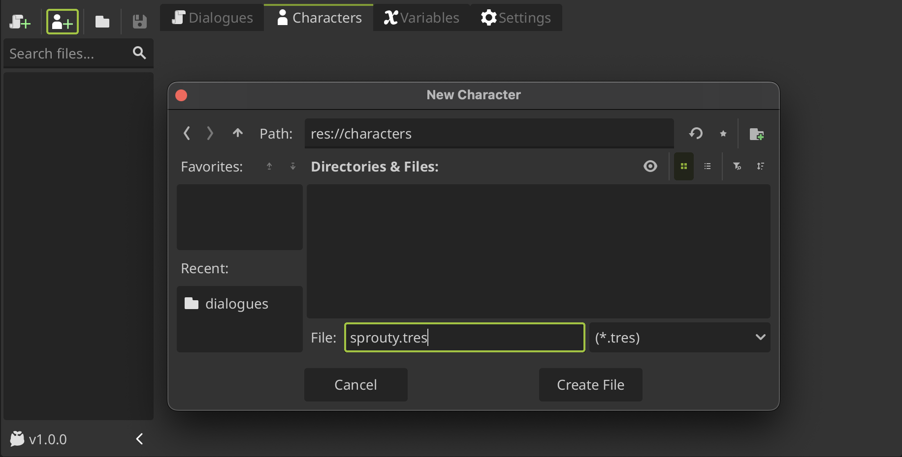
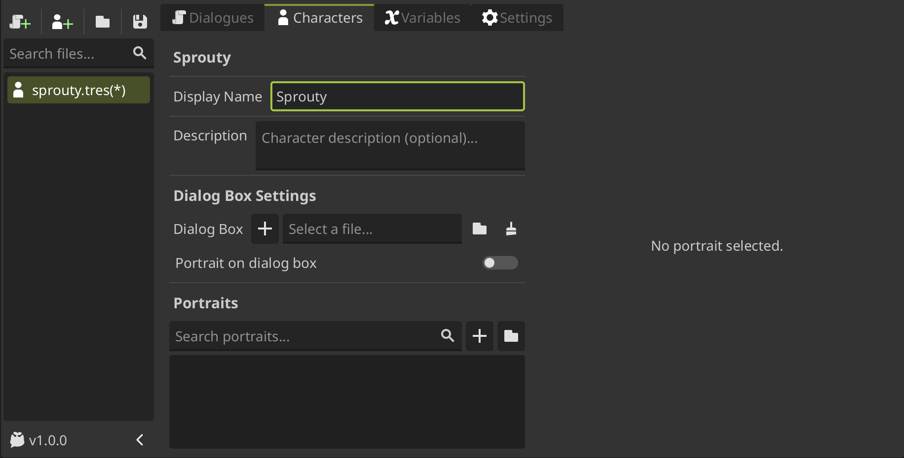
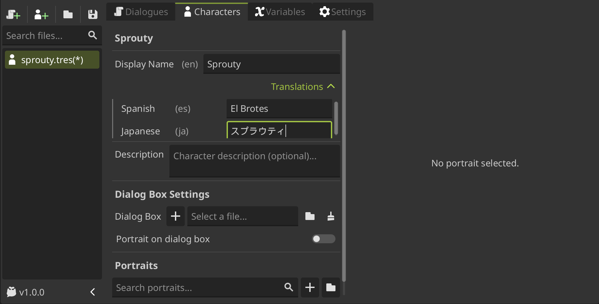
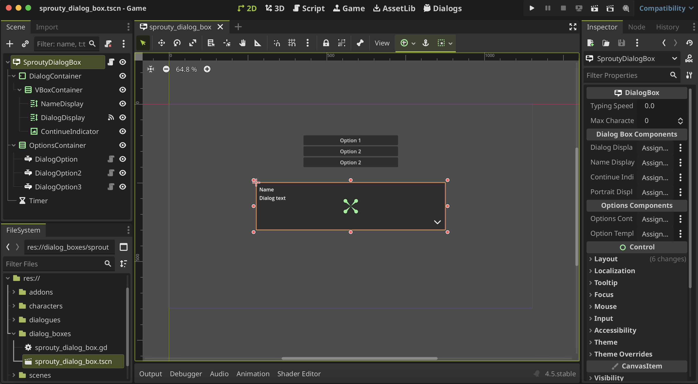
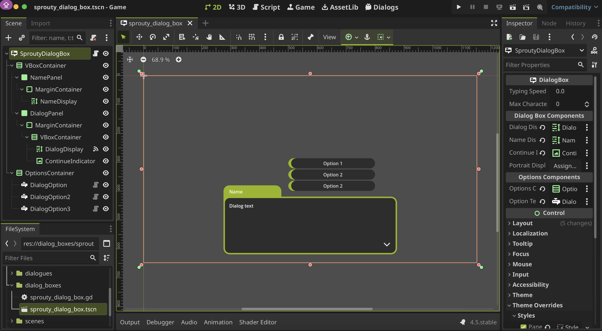
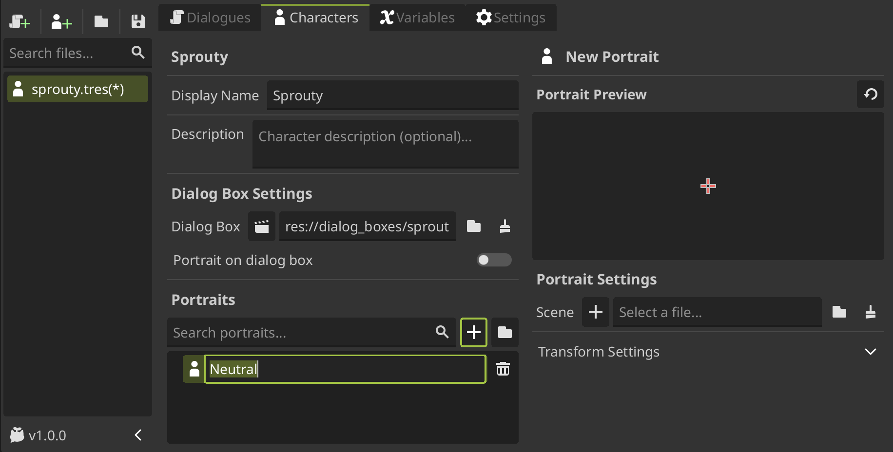
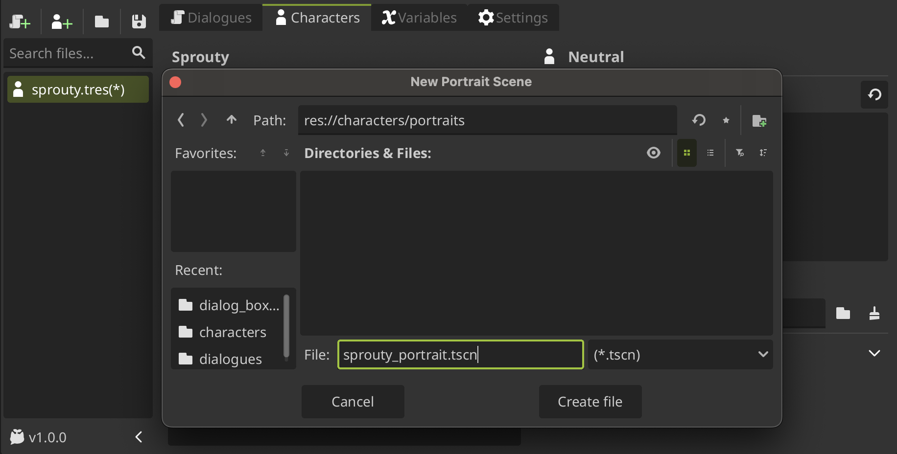
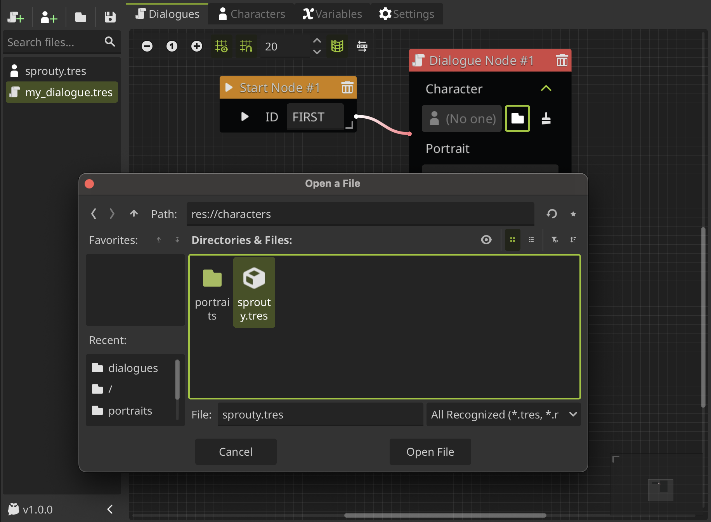
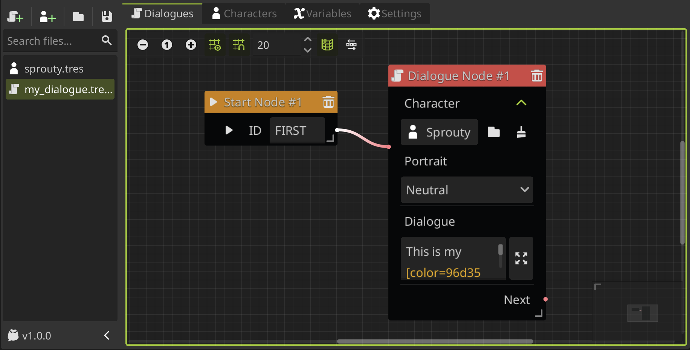
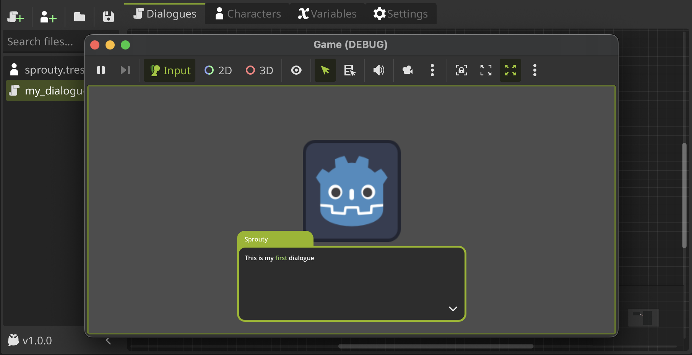

# Create a Character

In this section you'll go to learn how creating your own characters and use it in your dialogs.

## Character data

---

First, you need to create a new **character data file** that will contain all the character information, which will later be used to load characters in the dialogues and display them portraits on screen. The character data files are saved as `.tres` resource files.

To create a new character data file, **click on the New Character button**, locate where you want to save the file, give it a name and click on `Create File`.

:::info[Important]

The **file name will be the key to identifying the character** when it is referred to in dialogues, so give it a distinctive and unique name.

Don't worry, this is not the name that will be displayed in the dialogues. You can change the name to be displayed in the dialogue in the `Display Name` property.

:::

## Creating a character

---

Now you can configure your character to use it in your dialogues. At the top of the character editor interface, you'll see the file name as the character's key name, followed by some settings that we'll look at.

### General Settings

First, we have the `Display Name` property, that is the **string that will be displayed as the character name in the dialogues**. The display name can be translated to different languages if you have the **translations** enabled in settings. For more information about translations see the [translations section](/docs/translations.md).

Then, we have the `Description` property that does nothing, is only for your own reference.

### Dialog Box

You can also assign a specific dialog box for the character. For that you need to load a dialog box scene or create a new one. You can **create a new dialog box scene clicking the `+` button in the `Dialog Box` property**, locate where you want to save the file, give it a name and click on `Create File`.

When you create a new dialog box scene, the scene will open in the editor for editing. This scene is a template with a basic dialog box layout.

> In the file manager, you can see that in addition to the scene, **a script with the same name was created**: `sprouty_dialog_box.gd`.
>
> This script is a template that inherits from the [DialogBox](/docs/class-reference/nodes/dialog-box.md) class, and you can edit it to **customize the behavior of the dialog box with more advanced features**, for example, to add animations when the dialog box opens or closes.

**You don't need to use all the components in the template**; you can configure your dialog box however you want. Just keep in mind that you **need the components indicated in the inspector** depending on what you're going to do. For example, if you don't want to show the character name in the dialog box, you can not assign the `Display Name` component and the name will be not displayed.

Here is our example dialog box customized:

Here you can see a `Portrait Display` component in the inspector that is empty. This component is necessary if you want to display character portraits in the dialog box, which is configured in the character's `Portrait on dialog box` property.

If this option is enabled, **the character's portrait will be displayed as a child element of the `Portrait Display` component in the dialog box**. In this case, we don't want to display the portrait in the dialog box, so this component is not necessary.

:::info[Important]

You don't need to assign a dialog box for each character. You can define a **default dialog box** to use for all your dialogs in settings. Then, you can assign specific dialog boxes to some characters that will not use the default dialog box if you need to.

:::

For more information, see the [dialog boxes section](/docs/dialogues/dialog-boxes.md).

### Portraits

At the bottom of the character editor interface you gonna see the portrait list, when you can create different portraits for your character. To create a new portrait, **click on the `+` button** and give it a name.

When you create a portrait, you can see that the portrait editor appears in the right side of the character editor interface. Here you can see a preview of the portrait and some settings.

To see a portrait you need to load or create a portrait scene first. To create a new portrait scene, **click on the `+` button in the `Scene` property**, locate where you want to save the file, give it a name and click on `Create File`.

When you create a new portrait scene, the scene will open in the editor for editing. This scene is a template with a basic portrait, as the dialog box template. The portrait template allows you to **assign a image to display as the portrait** and provide some animations for when the character joins the dialogue, talk and leave the dialogue.

> You can **customize your own behavior for the portrait editing the script** that was created with the **same name of the scene**.
>
> This script is a template that inherits from the [DialogPortrait](/docs/class-reference/nodes/dialog-portrait.md) class, and provide some methods that you can override to change the behavior of the portrait and _do whatever you want!_

We'll do nothing in the scene for now, and if you go back to the character editor, you can see how a **new property called `Portrait Image` was added to the portrait settings**, where we can select an image.

And now we can see the image as the portrait in the preview!

Also, we can edit the portrait transformation settings to change the position, scale, and rotation with which the portrait will be displayed on the screen.

There are so many things you can do with portraits, for more information see the [customize portraits section](/docs/characters/customize-portraits.md).

## Using characters in dialogues

---

To use characters in your dialogues, **you need to assign them in the `Dialogue Node` where you want that the character talk** in your dialogue tree.

So, we'll going to open again our first dialogue, and in our little dialogue tree, we can **click on the folder icon in the characters section** to locate and select the character data file of the character that we want to assign, and then click on `Open File`.

Now, you gonna see the character key name in the character field of the `Dialogue Node` and we can see the portrait list in the portrait dropdown, when you can **select the portrait that you want to show with this dialogue**. In this case, we select the `Neutral` portrait that we made before.

So, now you can see the character and portrait setted in the `Dialogue Node`:

If we run the dialogue, now we'll going to see the dialog box and the portrait on screen.

Congratulations! You have created your first character and used it in your dialogues.

Now you know the basics of Sprouty Dialogs, but we've only scratched the surface! Here are some tutorials that you may find useful for your creations:

- [Dialog Boxes](/docs/dialogues/dialog-boxes.md)
- [Event Nodes](/docs/dialogues/event-nodes.md)
- [Variables](/docs/variables.md)
- [Translations](/docs/translations.md)
- [Customize Portraits](/docs/characters/customize-portraits.md)
