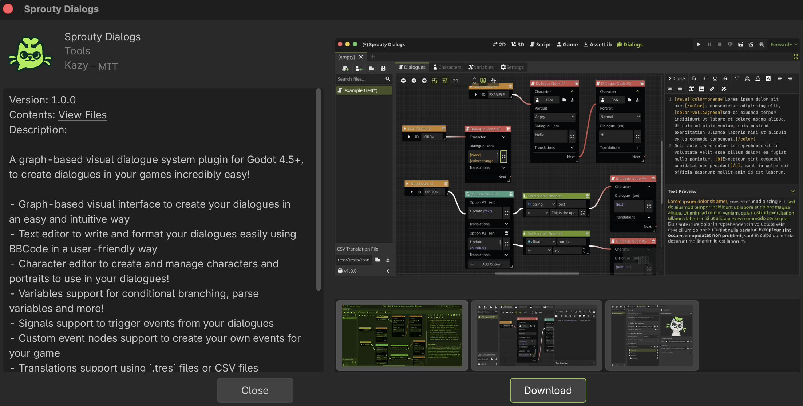

# Installation

:::info[Important]

Sprouty Dialogs requires **Godot 4.5** or higher!

:::

## Install from AssetLib

The easiest way to install the plugin is by using the AssetLib within the Godot engine.

To install the plugin from the AssetLib follow these instructions:

1. Search for "Sprouty Dialogs" in the Godot `AssetLib` tab
2. Select the **Sprouty Dialogs** plugin
3. Click on `Download`
4. Then you will see a preview of the installation in the `res://addons/` folder and click on `Install`
5. Now you only need to [enable the plugin](#enable-the-plugin)!

## Install from Github

For install the plugin from Github follow these instructions:

1. Download the `zip` file from [Github Releases](https://github.com/SproutyLabs/SproutyDialogs/releases) (recommended) or from the [main branch in Github](https://github.com/SproutyLabs/SproutyDialogs).

:::note

if you want to use the main branch for features or fixes that have not yet been released, click on the green `Code` button and then in `Download ZIP`.

:::

2. Extract the `addons` folder from the `zip` file. There is a `sprouty-dialogs` folder that contains the plugin.
3. Move the `addons` folder to the root of your project, or if you already have an `addons` folder, only move the `sprouty-dialogs` folder inside it.
4. If you have this path `"res://addons/sprouty-dialogs"` in your project, you succesfully added Sprouty Dialogs to your project! Now you need to [enable the plugin](#enable-the-plugin) in Godot.

## Enable the plugin

Now that you have the plugin in your project, you need to activate it to start use it.

1. Go to **Project > Project Settings**.
2. Click on `Plugins` tab.
3. Check the `Enable` box status ✅

4. You will see this new tab in the editor:

Congratulations! Now you can start to create your own dialogues with Sprouty Dialogs!
