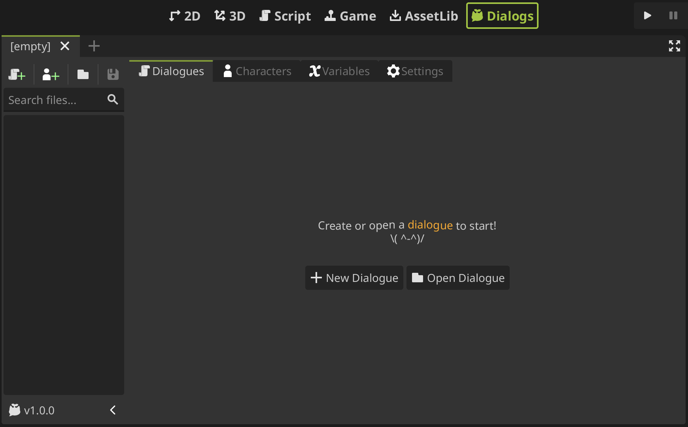
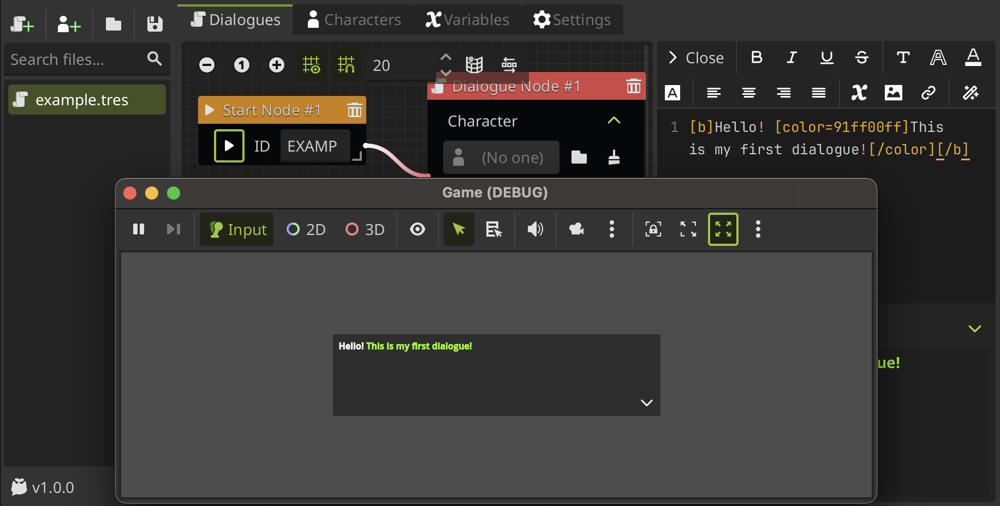
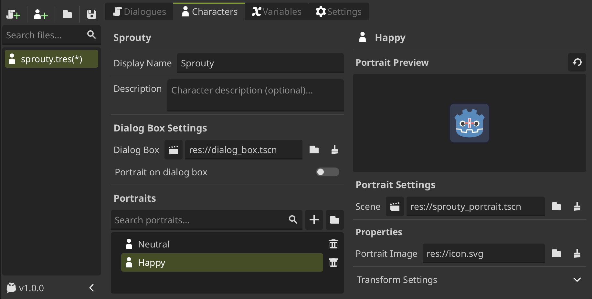

# Meet the Editor

Let's explore an overview of the plugin interface. When you click on the new **Dialogs** tab, you will see this view:

## Resource Sidebar

---

On the left, you will see a sidebar that displays the open dialogue and character files you are working with. At the top, you will see some useful buttons that allow you to **create a new dialogue, a new character, load a file, and save the file being edited**.

### Updating the plugin

On the other hand, the **current version of the plugin is shown at the bottom of the sidebar**. When you click on this button, you will see a popup with the plugin information, where you can update the plugin to a more recent version. **When there is a new version to install, it will be indicated with a colored button!**

:::warning[Important]

When you install an update, the current plugin folder `"res://addons/sprouty-dialogs"` will be deleted and replaced with the new version. **Any custom changes in that folder will be lost!**

:::

## Workspace

---

At the top of the plugin interface, there is a tab bar with each module of the plugin: **Dialogue, Characters, Variables and Settings.** Each module allows you to do different things and has its own interface. Let's take a look at them.

### Dialogue Editor

The dialogue editor is a graph view where you can create your own dialogues usign [event nodes](/docs/dialogues/event-nodes.md). Each event node has a different function, and by connecting them, you can create dialogue trees that will define your dialogues.

On the right of the graph editor is the text editor. When editing dialogue text, you can expand the text box and edit the dialogue in the text editor. This not only gives you a larger view, but also allows you to use a toolbar to easily add [BBCode](https://docs.godotengine.org/en/latest/tutorials/ui/bbcode_in_richtextlabel.html) tags to your dialogue! **Change the color, size, font, add text effects, and much more!**

The text editor have a text preview where you can see the [BBcode](https://docs.godotengine.org/en/latest/tutorials/ui/bbcode_in_richtextlabel.html) tags working for a faster editing. But, you can also preview your dialogues in a in-game view by clicking the play button on the **Start Node** of your dialogue.

If you don't understand this completely, don't worry, this is only an overview. In the next section, you'll learn how to [create your first dialogue](create-a-dialogue).

### Character Editor

The character editor allows you to create characters to use in the dialogues. The interface have two sections:

- First, you can set the character's name that will appear in the dialog box, a custom dialog box for the character if you want to use it, and more..., such as portraits!
- The second section is the portrait editor, where you can edit a portrait selected from the list of characters.

You can learn more about characters in [create a character](create-a-character).

### Variable Editor

The variable editor allows you to create variables for use in dialogues. You can add variables of different types, group them, and edit them. These variables can be used for display in dialogues, conditional events, and more.

> You can call variables within `{}` to use them in text, as can be seen in `not_pass_alert`, which uses the variable `alert_color` to color the text.

At the bottom of the interface, you can see the text editor again, because the string field can be expanded in the same way as before with the dialogue text boxes.

For more information about variables see the [variables section](/docs/variables.md).
