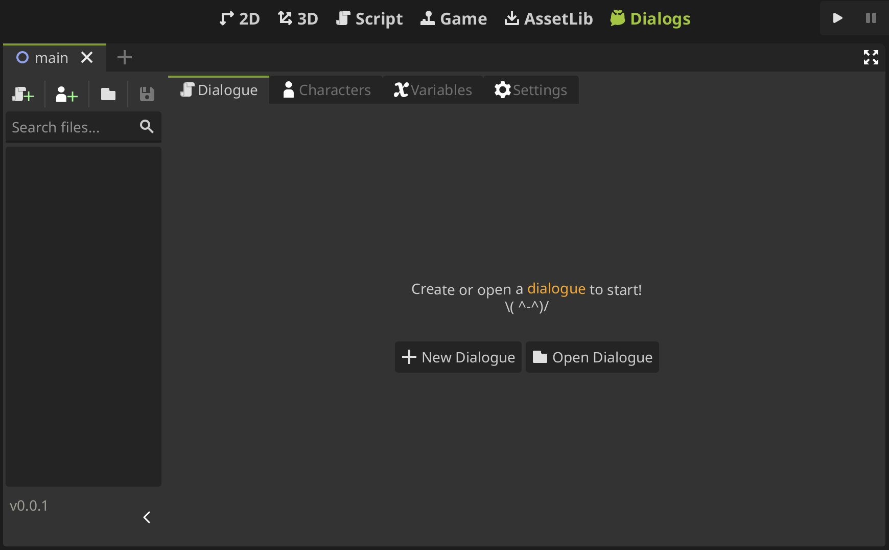

# Meet the Editor

Let's explore an overview of the plugin interface. When the plugin starts, you gonna see this view:

Here you can create a new dialogue...

## Graph Editor

## Character Editor

## Variable Editor

## Settings
