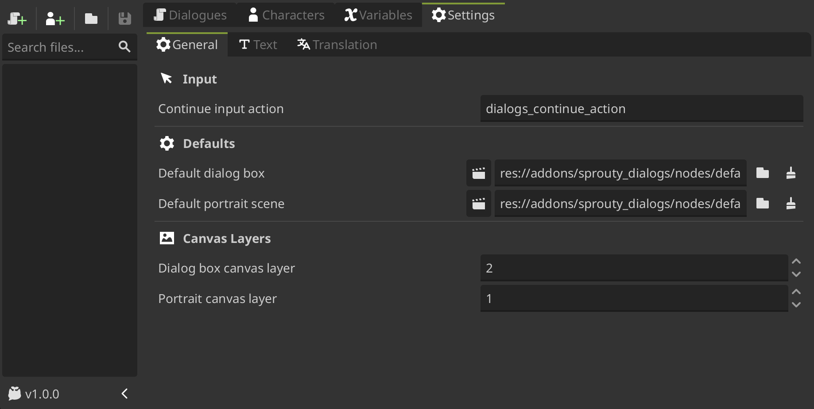

# Settings

In this section we'll going to explore the Sprouty Dialogs plugin settings.

The plugin settings has their own tab in the plugin interface, where you can access and handle them. Here you can set different configurations to _customize your dialogue system!_



Let's take a look at each category and its settings.

## General settings

---

### Input

- `Continue Input Action`: The input action that allows the dialog to continue.

  > _By default, Sprouty Dialogs have a input action called `dialogs_continue_action` that allows the player to continue the dialogue by pressing the `[Enter]` or `[space]` keys, clicking the left mouse button or the right gamepad action button._
  >
  > 

### Defaults

- `Default dialog box`: Default dialog box that will be displayed when no character is selected. It will also be used as a template when creating a new dialog box for a character. The root of the scene must be a node inherited from the [DialogBox](/docs/class-reference/nodes/dialog-box.md) class.

  > _By default, the default dialog box is a template that look like this:_
  >
  > 

- `Default portrait scene`: Default portrait scene that will be used as a template when creating a new portrait for a character. The root of the scene must be a node inherited from the [DialogPortrait](/docs/class-reference/nodes/dialog-portrait.md) class.

  > _By default, the default portrait scene is a template that allows you to display an image as portrait:_
  >
  > 

### Canvas Layers

- `Dialog box canvas layer`: Layer index for the **draw order** of the canvas layer where dialog boxes will be displayed by default, if the dialog box parent is not overriden.

  > _By default, the dialog box are displayed **in front of the portraits**, so its canvas layer index is 2._

- `Portrait canvas layer`: Layer index for the **draw order** of the canvas layer where portraits will be displayed by default, if the portrait parent is not overriden.

  > _By default, the portraits are displayed **behind the dialog box**, so its canvas layer index is 1._

## Text Settings

---

### Text Behavior

- `Default typing speed`: Time in seconds that the text takes to reveal each character. The higher the number, the longer it will take to reveal the next character.

- `Open URL on meta tag click`: If enabled, **opens a hyperlink in the browser when a URL tag is clicked** during a dialog. By default the URL tags are handled by [meta_clicked](https://docs.godotengine.org/es/4.x/classes/class_richtextlabel.html#class-richtextlabel-signal-meta-clicked) signal on [RichTextLabels](https://docs.godotengine.org/es/4.x/classes/class_richtextlabel.html). You can do the same with the [meta_clicked](/docs/class-reference/nodes/dialog-box#meta-clicked-signal) signal in a [DialogBox](/docs/class-reference/nodes/dialog-box.md) to more advanced use cases.

### Dialogue Display

- `New line as new dialogue`: Line breaks will be considered paragraphs. Each paragraph is displayed as a new dialog (or block of text in the dialog box). Otherwise, the text is displayed all at once.

- `Split dialogue by max characters`: The text is divided into paragraphs according to a character limit. Otherwise, it is displayed all at once.

- `Max characters`: Maximum character limit. Only used if the dialogue is split by a character limit.

### Skip Text Reveal

- `Allow skip text reveal`: Allows to skip text reveal and display everything at once.

  > _When is enabled, you can skip the text revealing and display the dialogue at once by **performing the continue input action** while the text is revealing._

- `Can skip delay`: Time in seconds during which the text cannot be skipped again. This is necessary to prevent the entire text from being skipped.

- `Skip continue delay`: Time in seconds during which you must wait for the dialogue to continue after skipping the text reveal.

## Translation Settings

---

- `Enable translations`: Enable/disable translations for dialogues.

- `Use CSV files`: Enable the use of CSV files for translations. Otherwise, translations will be saved in the **dialogue data file**.

- `CSV Translations Folder`: Path to the directory of the CSV translation files. This directory **must contain all the CSV files used for the dialogs** _(It is necessary to collect all translations in godot)._

  :::warning[Important]

  _The csv translations folder can contain subfolders to organize them if you wish, but you must **ensure that all your csv translation files are inside** this folder or its subfolders._

  :::

- `Fallback to resource`: When a dialog key is not found in the CSV file, the dialog will be loaded from the **dialogue data file**. _(This only applies when opening a dialog file in the editor, not when running the dialog)._

- `Translate character names`: Enable translation for the character names.

- `Use CSV for character names`: Enable the use of CSV files for character name translations.
  Otherwise, translations will be saved in the **character data file**.

- `Character Names CSV`: Path to the CSV file with the character name translations. **It must be inside the CSV translations folder**.

- `Collect translations`: Collect the translations from CSV files into Godot so they can be used. You can find the collected translations in **Project settings > Localization > Translations**.

### Locale Settings

- `Default locale`: The locale in which the **dialogues are going to be written by default** in the plugin.

  > _The default locale is asumed by the plugin as the **main language** in which the dialogue are going to be writen, because of that, all the text boxes by default will indicate this locale._
  >
  > _The other locales will be consider translations of the text written in this main locale, so their text boxes will be in a separate translation section._
  >
  > _For example:_
  >
  > 
  >
  > _You can see here that the default locale is **English (en)**, and that the other locales are in a translations expandable section._

- `Testing locale`: The locale that will be used to **test the dialogue when the game is run**. If no one is selected, _the automatically detected system language will be used_.

  > This setting is equivalent to the **Project Settings > Internationalization > Locale > Test** property. See [testing translations in godot docs](https://docs.godotengine.org/es/4.x/tutorials/i18n/internationalizing_games.html#testing-translations) for more information.

- `Locales`: Set the locales into which the dialogs will be translated.

  > _The locales are the combination of a **language with a region or country** in which the dialogs will be translated. In this list, you can add and remove the locales in which you want to translate your dialogs._
  >
  > _This allows to **configure the plugin to handle this locales**, mainly to add the text boxes necessaries to write the translations in it, but also to save the translations correctly._
  >
  > 
  >
  > For more information about locales see [internationalizing games in godot docs](https://docs.godotengine.org/es/4.x/tutorials/i18n/internationalizing_games.html#locale-vs-language).

## Handle settings from code

---

You can access and handle the plugin settings from the **Sprouty Dialogs autoload** by the `Settigns` property:

```gdscript
# Get a setting
SproutyDialogs.Settings.get_setting("setting_name")

# Set or update a setting
SproutyDialogs.Settings.set_setting("setting_name")
```

:::info[Important]

You need to write the setting name in `snake_case`.

:::

Also, you can do other useful things such as:

```gdscript
# Check if a setting exist
SproutyDialogs.Settings.has_setting("setting_name")

# Get the default value of a setting
SproutyDialogs.Settings.get_default_setting("setting_name")

# Reset a setting to its default value
SproutyDialogs.Settings.reset_setting("setting_name")
```

See the [settings manager class reference](/docs/class-reference/utils/settings-manager.md) for more information.
