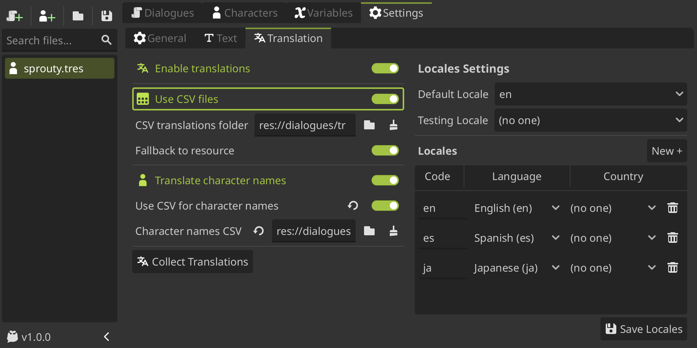

# Translations

You can translate your dialogues into multiple languages using the Sprouty Dialogs built-in translation system.

This system allows you to edit your dialogues and their translations **within its interface**, _**without the need for external tools!** ... and allowing you to use **all the text editor features for translations!**_

_Also, you can translate **character names** as well!_

:::info

Sprouty Dialogs support translations in `.tres` (by default) and CSV files. Godot also supports `gettext`, but it is not currently integrated into the plugin.

:::

## Using translations

---

### Setting up translations

To use translations, go to the `Settings` tab in the plugin interface and then to the `Translations` tab. Here you can enable the translations checking the `Enable translations` checkbox.


You need to set what locales your going to translate your dialogues in the `Locales` list. You can add a locale pressing the `New +` button, and then you can select a **language** and optionally a **country** where you want to localizate your dialogues.


Once you have added the desire locales, **don't forget to press the `Save Locales` button!**

Also, you can write the locale code directly in the text input and select the language and country from a filtered list. The locale codes have the format `language_COUNTRY`, for example:

- `en_US` is `English, United States of America`
- `es_CL` is `Spanish, Chile`

:::info

Locale codes can have more indications, such as a **script or variant code**, so the complete format is `language_script_COUNTRY_VARIANT`. You can add this additional codes in the locale codes manually using the text input. We wanted to mantain it simple for the most use cases, so the UI only contemplate languages and countries.

You can see [locale codes in godot docs](https://docs.godotengine.org/en/stable/tutorials/i18n/locales.html) for more information.

:::

### Writing translations

Once you enable translations and set the locales, now you can see that a **translations section** appears in the dialogue nodes, options nodes, character names and everything than can be translated!


You can see that the text box of the **dialogue is now associated with a locale**, specifically the **default locale** (in this example, “en” or English), which means that the dialogs written in that text box will be the dialogs for this default locale. You can set the default locale in the [translation settings](/docs/settings#locales-settings).

The text boxes for edit the dialogues in other locales are in the **translation section**, where you can write and edit each of your translations using the text editor in the same way that the default dialogue.

### Translating characters

To use translations for the character names, you need to enable the `Translate character names` setting in the [translation settings](/docs/settings#translation-settings).

At the same way that before, when you edit a character and the translations are enabled, you will going to see that in the `display name` property the default text input now is associated with the **default locale**. Also, there is **translation** section where you can translate the name that will be displayed on the dialog box to each locale.


### Testing translations

To test the translations, you can select the locale in which you want to test the dialogues in the `testing locale` dropdown from [translation settings](/docs/settings#locales-settings). If **no testing locale is selected**, the **automatically detected system locale** will be used. Then you can run the dialogue from a **play button** from a `Start Node` or directly run the project to test your dialogues.

:::info[Important]

This **only works on the editor**, may not work in exported projects. To change the locale when the game is exported see the [changing the language](#changing-the-language) section.

:::

### How translations are saved?

By default, translations will be saved in the same `.tres` file you are working on, in the **dialogue data file** or **character data file** where you are writing the translations.

For dialogues translations, **each dialogue has a unique key associated with it**. Therefore, each dialogue text in a `Dialogue Node` has an associated key, and each **option** text in an `Options Node` also has a key.

:::note[Dialogue keys format]

Each **dialogue** text from a **dialogue node** has a key with the format:

```gdscript
<START_ID>_DIALOG_<NODE_INDEX>
```

> For example, `EXAMPLE_DIALOG_1` is the key of the dialogue text from `Dialogue Node #1` that belongs to the dialogue tree with start ID: `EXAMPLE`.

For the other hand, each **option** text from a **options node** has a key with the format:

```gdscript
<START_ID>_OPT<NODE_INDEX>_<OPTION_INDEX>
```

> For example, `EXAMPLE_OPT1_2` is the key of the dialogue text from the **second option** of `Options Node #1` that belongs to the dialogue tree with start ID: `EXAMPLE`.

:::

In that way, you also can edit the translations outside the plugin, editing the dialogues from the **dialogs** dictionary in the `.tres` file.

However, if you want to edit translations mainly outside the plugin, it's better to use CSV files.

## Using CSV files

---

The most common way to localize games is using spreadsheets. Godot support CSV files for that, how its described in the guide [localization using spreadsheets in godot docs](https://docs.godotengine.org/en/stable/tutorials/i18n/localization_using_spreadsheets.html#doc-localization-using-spreadsheets). Sprouty Dialogs uses Godot's integrated localization system to use translations in CSV format.

To use CSV files for translations, you need to enable the `Use CSV files` setting in the [translation settings](/docs/settings#translation-settings).



Once enabled, you can see new settings such as `CSV translation folder`, where you need to **select a directory where the CSV translations files will be saved**.

This is required to **collect the translations into the project**, because Godot needs to import all the CSV files as translations files to use them, how is described in [internationalizing games in godot docs](https://docs.godotengine.org/en/stable/tutorials/i18n/internationalizing_games.html).

:::info[Important]

The plugin **automatically collect all the CSV files** that find in the selected translations folder **when a dialogue or character file is saved**.

In this way, you don't need to collect them manually, but in case that something went wrong, or you change the file outside the plugin, you can click on the `Collect Translations` button to do so.

:::

:::warning[Important]

_The csv translations folder can contain subfolders to organize them if you wish, but you must **ensure that all your csv translation files are inside** this folder or its subfolders._

:::

Now that the using of CSV files is enabled and the translations folder is setted, when you create a **new dialogue file** Sprouty Dialogs **automatically will create a new CSV file with the same name in the translations folder**, where your translations will be saved.

You can find the CSV file associated to your dialogue file in the `CSV Translation File` field at the bottom of the side bar. Here **you can change the CSV file** where your translations will be saved if you want.


:::info

**CSV files are updated on save**. Any modified dialog or translated text is updated, but the rest of the CSV content is not replaced or deleted. Therefore, a single CSV file can _**contain translations for more than one dialogue file**_, so you can associate a CSV to more than one dialogue file.

Just make sure that **each dialogue has a unique key**, which means that **each dialogue tree needs a unique ID**, to avoid overriding errors.

:::

### Editing CSV files

You can edit the CSV files **outside the plugin**, using any spreadsheet software, like Excel or Google Sheets. You can even edit them as plain text. This is because CSV files are a simple, plain text file format for storing tabular data, like spreadsheets, where each line is a row and the values within a row, separated by commas, define the columns.

Specifically, the CSV format for translations looks like this:

```
keys,en,es,ja
HELLO_DIALOG_1,Hello There!,¡Hola!,こんにちは！
HELLO_DIALOG_2,Hiii!,¡Holiiis!,やあ！
```

That is equivalent to this table:

| keys           | en           | es        | ja           |
| -------------- | ------------ | --------- | ------------ |
| HELLO_DIALOG_1 | Hello There! | ¡Hola!    | こんにちは！ |
| HELLO_DIALOG_2 | Hiii!        | ¡Holiiis! | やあ！       |

How you can see, the first column have the **keys of each dialogue** (in the same format than was explained [here](#how-translations-are-saved)), and then each of the others columns have the **translated dialogue in a specific locale**. For example, here we have two dialogues translated to English, Spanish and Japanese.

If you edit the CSV translations outside the plugin, when you open the dialogue file associated, the dialogues are going to be updated as well. You must open and **save the associated dialogue file to collect the updated translations** before running the dialogues, or they may not be updated in the project.

:::info[What if some dialogue is missing?]

When you edit CSV files outside of the plugin, some problems may occur, such as some **dialogue keys and their translations being missing**, either because they were accidentally deleted or for some other reason. For this cases, there is a `Fallback to resource` setting.

If `Fallback to resource` is enabled, when you open a dialogue file and a **key is not found in the CSV**, the dialogue will be **loaded from the dialogue file instead**. This is a editor-only feature to allows you to restore the dialogue missing in case that the CSV have some error, this not work on run.

_The dialogue file always have a copy of the dialogues, so you can recover the missing dialogues from there._

    :::warning[Important]

    If you edit the CSV file outside the plugin, and you have not **updated the dialogue file** opening and saving it again, the dialogue data file will not have the dialogues updated. So then if you lose a dialogue from the CSV, you cannot be able to recover it.

    :::

### Character names using CSV

To translate character names using CSV files, you need to have enabled `Use CSV files`, and enable `Translate charater names` for then enable the `Use CSV for character names` setting.


If you already have the CSV translations folder set up (which you **should** have!), when you enable the `Use CSV for character names` setting, a **new CSV file is going to be automatically created** in that folder. This file is called `character_names.csv` by default, and _all the character names and its translations will be saved here._

The CSV format for the character names look like this:

```
keys,en,es,ja
SPROUTY_CHAR,Sprouty,El Brotes,スプラウティ
```

That is equivalent to this table:

| keys         | en      | es        | ja           |
| ------------ | ------- | --------- | ------------ |
| SPROUTY_CHAR | Sprouty | El Brotes | スプラウティ |

As you can see, in this case we use the **file name or character key name** in uppercase, along with the suffix `_CHAR` as the translation key format. This is to ensure that character name keys are not confused with other translation keys.

You can change the CSV file where the character names will be saved in the [translation settings](/docs/settings#translation-settings).

## Changing the language

---

To change the language or locale of your dialogues (and project in general), use the method [set_locale](https://docs.godotengine.org/en/stable/classes/class_translationserver.html#class-translationserver-method-set-locale)() from the [TranslationServer](https://docs.godotengine.org/en/stable/classes/class_translationserver.html#translationserver) class of the Godot API.

```gdscript
# Change language to Spanish (es)
TranslationServer.set_locale("es")
```

When using CSV files, dialogues will be handled by the Godot API, so you need to **ensure global unique keys** for dialogues and that the **translations are correctly collected**. Otherwise, translations will be loaded directly from your dialogues and characters `.tres` files.
