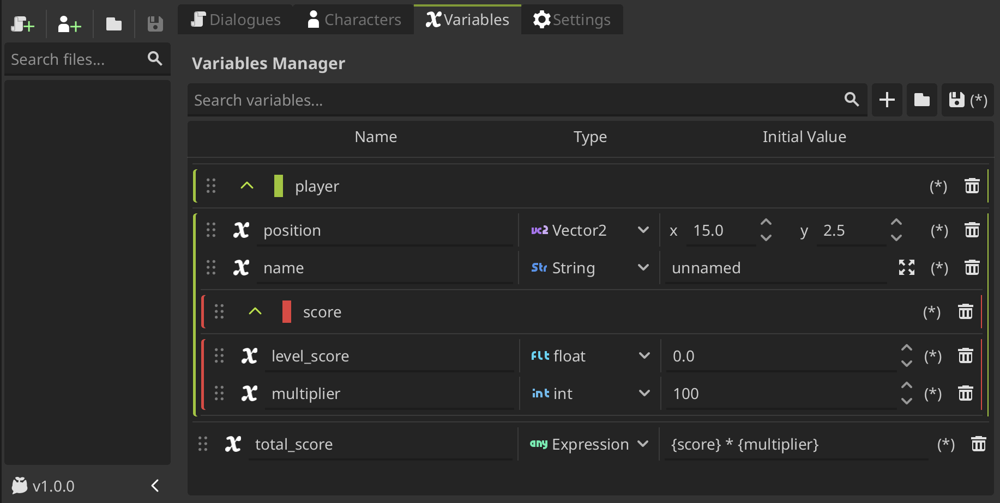
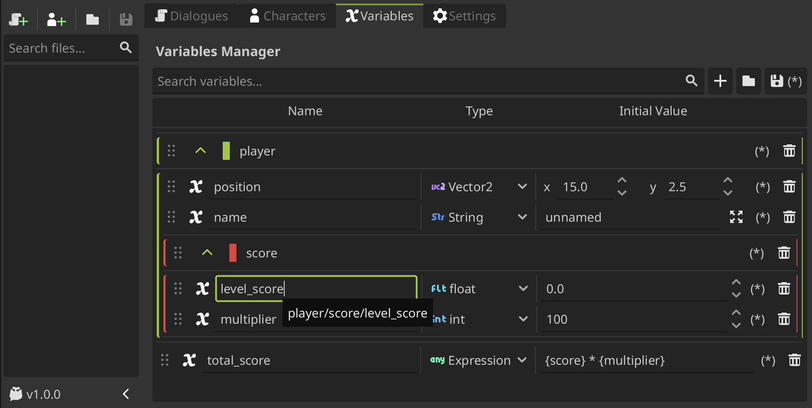
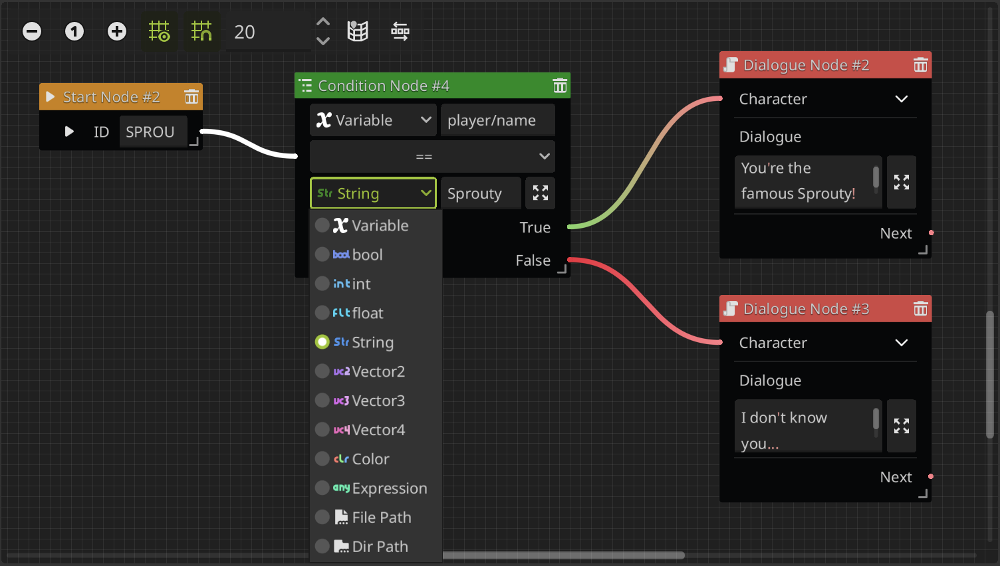

# Variables

In this section we'll going to explore all about variables in the Sprouty Dialogs plugin.

> Variables are useful for many things, you can use it to **display values** that will going to change during the dialogues, **use conditions** to branch your dialogue flow, standarize colors or styles for some text, such as names or keywords, _and much more!_

Let's take a look at what we can do with variables and how to use them.

## Using the variable editor

---

The Sprouty Dialogs plugin **has a built-in interface to handle variables in a user-friendly way**.

The variable editor allows you to **create and handle variables of different types** to use in your dialogues. You can add, remove, rename, set an inital value and filter the variables. They can be **organized into groups** and support drag-and-drop reordering.



As you can see, **groups can be nested** and **assigned a color** to distinguish them more easily. To change the group color, **click on the squared colored button at the left of the group name** and select a color.

:::info[Important]

You must have **unique variables and group names in the same level** or group, but you can have variables or groups with the **same name in different groups**.

:::

When grouping variables, you must consider the **full path to reference a variable**, not just the variable. So, when you gonna call a variable, you need to use their full path as the variable name.

To view the full path for each variable or group, you can **hover your cursor over it for a moment**.



:::info[Important]

When you edit or add variables **don't forget to save** to apply the changes!

Otherwise, you cannot be able too see and use the variables correctly updated in the dialogues.

:::

With the variables configured here, you can do many things! Let's take a look.

## Using variables in your dialogues

---

### Variables in text

- You can insert variables in your dialogues by writing the name as `{variable_name}`. If your variable is **inside a group** you need to refer them using their full path as: `{group1/group2/variable_name}`.

- Also, you can use **global variables from Autoloads**. To use global variables, you need to write the variable as `{AutoloadName.variable_name}` to use them.

You can also use expressions inside the brackets. See the [using expressions section](#using-expressions).

### Variables in character names

You can use variables in the `display_name` of the characters in the same way as in text. You can use a variable as a name or add variables in a name to do other things, such as stylish the name display.

> For example, a `display_name` can be the player name as `{player}` or maybe just a stylish name like `[color={player_color}] Sprouty`, or _why not both as `[color={player_color}]{player}`_.

You can use **global variables** as well as **Sprouty Dialogs variables**.

_Also, you can use variables in the name **translations**._

### Variables in conditions

Conditions allows to change the flow of the dialogue, so they are one of the main uses for variables. You can add conditions in the dialogue tree using the [condition node](/docs/dialogues/event-nodes#condition-node).



You can check relations between two variables, variable and value, expressions, etc. Also, you can compare **global variables** as well as **Sprouty Dialogs variables**.

:::warning[Important]

You must check that the **comparation is valid**. You cannot compare an [String](https://docs.godotengine.org/en/stable/classes/class_string.html) and a [Vector2](https://docs.godotengine.org/en/stable/classes/class_vector2.html), for example, as this will throw an error when the dialogue runs.

:::

### Set variable events

You can update or change the variables values in the dialogue tree using the [set variable node](/docs/dialogues/event-nodes#set-variable-node). You can update **global variables** as well as **Sprouty Dialogs variables**.


You can update the value using different **assignment operations** depending on the type of variable.

## Using expressions

---

Expression are **simple operations** that you can use in combination to variables. In text, you can use expressions inside brackets `{}` to do things like **math operations, boolean operations, and more**. For more information see the [evaluating expressions godot tutorial](https://docs.godotengine.org/en/stable/tutorials/scripting/evaluating_expressions.html). For example:

- Increment a variable: `{{variable} + 1}`
- Multiply two variables: `{{first_variable} * {second_variable}}`

You can use **global variables** as well as **Sprouty Dialogs variables** in expressions.

Also, variables can be of the **expression type**. This type allows you to have variables that parse expressions, and you can use them like any other variable: in text, conditions, etc.

## Using variables in code

---

You can use the variables of Sprouty Dialogs from scripts outside the plugin. You can access them from the **Sprouty Dialogs autoload** by the `variables` property:

```gdscript
# Get variable value
SproutyDialogs.variables.get_variable("variable_name")

# Get variable inside a group
SproutyDialogs.variables.get_variable("variable_group/variable_name")
```

:::info[Important]

As the same way that before, if the variable is inside one or more groups, you need to set its full path as its name, such as: `"group1/group2/variable_name"`. The same applies when referring to the name of a group within other groups.

:::

Also, you can change the value of a variable, check if exist, and other useful things such as:

```gdscript
# Change the value of a variable
SproutyDialogs.variables.set_variable("variable_name")

# Check if a variable exist
SproutyDialogs.variables.has_variable("variable_name")


# Get a list with the names of the variables in a group
SproutyDialogs.variables.get_variables_in_group("group_name")

# Check if a variable is in a group
SproutyDialogs.variables.is_variable_in_group("variable_name", "group_name")


# Reset a variable to its initial value
SproutyDialogs.variables.reset_variable("variable_name")
```

See the [variable manager class reference](/docs/class-reference/utils/variable-manager.md) for more information.
